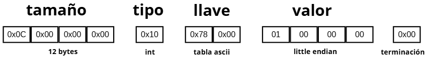
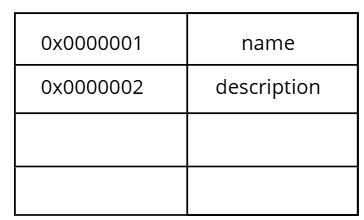
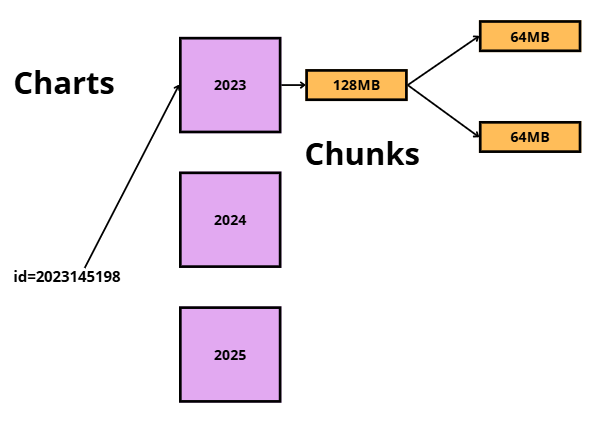

	Bases de Datos II
	Helena Vargas
	II Sem 2025
## Anotaciones 07-10-25

# Mongo Atlas

## Parseo
El parsing se trata de traducir de xml a json.

Los web services y las bases de datos NoSql utilizan json, para no tener que pasar por parseo. Esto ayuda a ahorrar memoria y cpu porque no se transforman datos.

Las bases de datos tienen un lenguaje de intercambio de datos. Por ejemplo MySql, tiene un mecanismo binario de intercambio de datos que compila el sql en lenguaje binario, los cuales son extraidos por MySql. 

Si se hace una llamada directa entre un api y una base de datos, hay un gasto de recursos en la base de datos. 

Los web services tienen un lenguaje que utiliza la red, el cual es el protocolo http. Este es un lenguaje tipo texto. Tiene como un resultado un json. Ambos utilizan caracteres en la tabla ascci. Ahorra la transformación de datos. 

## Mongo

Mongo tiene un document model, que es la parte más importante de la base de datos. Utiliza un modelo Key-Value pairs. El Key es único y está asociado a un grupo de datos que puede estar en cualquier formato. Un objeto solo es un conjunto de jsons anidados.

Se puede hacer una representación de documento en json (java script object notation). Un documento es equivalente a un row en una base de datos SQL. Se puede modificar la estructura del documento y agregar cam´pos dinámicamente. Por esta razón, los documentos pueden tener diferentes campos. 

Se puede representar cualquier tipo de datos. La cuota superior de Mongo es de 16MB, sino no se puede almacenar dentro de Mongo. 

Al amacenar documentos se tienen datos binarios. Los datos binarios incluyen imágenes, videos, audios, archivos .exec, .zip, .tar. Cualquier archivo que no se puede abir y leer como texto plano. 

Cuando se debe guardar algo binario dentro de un json, se puede convertir a base 64. Esto quiere decir que una representación binaria se convierte a una representación visual en texto. Codifica lo binario a los 64 caracteres visibles de la tabla ascci. Esto causa que el tamaño de los datos crezca. 

### Ejemplo:

** El lenguaje decimal tiene 10 símbolos, del 0 al 9.
Cada símbolo equivale a un byte:
0x00, 0x01... **

Pero la base 64 no permite utilizar todos los caracteres.

Así que si queremos representar 2536, en decimal se hace de la siguiente manera:

** 0x02  0x05  0x03  0x06 = 4 bytes **

Pero si no se pueden usar todos los caracteres, crece la cantidad de caracteres que se deben utilizar para representar los datos. Esto hace que los archivos binarios fácilmente se acerquen al límite de 16MB de Mongo.

Los textos guardados en texto plano guardados en Mongo se guarda como string, pero en caso en que no hay match se puede estar desperdiciando el potencial de la base de datos al estar guardados en base 64. Para esto Mongo puede usar gridfs. También se puede utilizar un object storage, y solo guardar una referencia. 

Almacenar json en una colección puede ser complejo, porque el tamaño del documento crece mucho. Además es ineficiente para la base de datos.

La alternativa es usar un solo archivo y cada uno está conectado a uno más grande. Así para abrir json solo hay que abrirse sobre ese archivo. Pero estos archivos grandes también son json. Es posible tener que hacer un escaneo (recorrer 1 por 1) para encontrarlo, pero esto no es recomendado. Lo mejor es brincar de documento en documento.

Para esto se utiliza el binary Bison. El documento se convierte a representación de registro, donde se determina el tipo de field. Luego se determina la llave que es la representación ascci en un arreglo.  Luego se representa el valor. Esto se maneja como little endian, donde se invierten los bytes. Siempre termina con 0x00. Luego se cuenta la cantidad de bytes y se traduce a hexadecimal para guardar el tamaño.

### Ejemplo:

En Mongo los esquemas son flexibles. Los documentos pueden ser distintos y tener distintos tamaños. Se sabe exactamente cuanto mide el document size, tipo, name, y valor. Así puede mover el lector del disco los caracteres necesarios, e ir saltando entre documentos de manera eficiente. Así no debe revisar byte por bytes para saber donde comienza y termina un documento. 

## Compression
Algo dañino es el nombre del campo. Pueden acumular muchos bytes muy rápidamente por el nombre de las claves. Si el field name está repetido y no va a cambiar, se usa un tipo de compresión. Se codifican los nombres en una tabla y esto optimiza el uso de disco.

## Wiredtiger

Maneja los documentos. Sin embargo, se come la memoria. Puede matar al sistema operativo. 

## OCR
Se pasan las imagenes por OCR. Esto es un reconocimiento de caracteres. Se extrae todo el texto que tiene la imagen. Esto tiene sentido, ya que se puede encontrar el texto en la imagen guardando directamente en Mongo.

Con videos se puede desplegar el video con el desplazamiento donde se muestra el texto.

## Speech to text
El audio se pasa por un sistema speech to text. Así se extraen los datos.

Zip o targs solo se transforma el texto.

Con este procesamiento extra se pueden realizar búsquedas sobre documentos binarios

En mongo una base de datos es una colección, y la colección tiene un contenedor que tiene documentos. La tabla es lo mismo que el contenerdor. Y una row es un documento.

## Charts y Chunks

Hay charts (replicas) de distintas categorías. Por ejemplo, para los carnets del tec, hay un chart 2023, un chart 2024 y un chart 2025.

Cuando hay un raw dataset con un id, por ejemplo 2024145198, se le pregunta a mongos donde guardarlo y se almacena en un nodo. 

Los charts están divididos en chunks. El chunk guarda el documento. Si se acaba el espacio, el chunk se divide en dos chunks. Se puede usar el chart key para subdividir los datos. Cada vez que un chunk crece mucho, se va a dividir. Si un chunk crece mucho se hace un Jumbo. 

Si un chart se llena mucho, se cambian los chunks de chart, si el chart key lo permite. 

## Replica set

No hay un concepto de chart. Cada servidor tiene 100% de los datos. 

## Replica set charted

Se puede escoger cuántas réplicas por chart se pueden tener.

