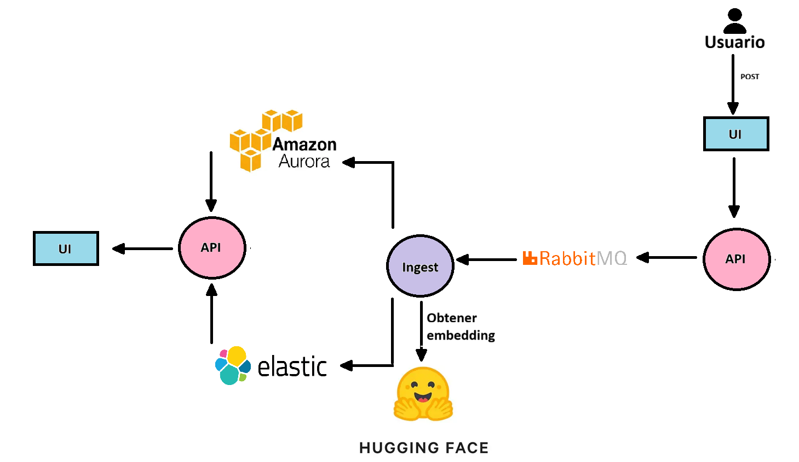
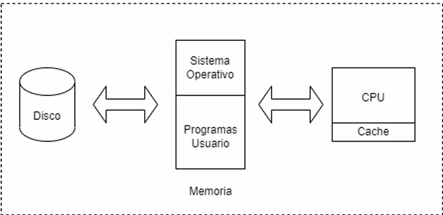

	Bases de Datos II
	Helena Vargas
	II Sem 2025
## Pregunta 1
### Dar una solución detallada de cómo podría mejorar el rendimiento de la base de datos actual, reduciendo el downtime al mínimo. Esto permitirá ganar tiempo para ofrecer una solución mucho más duradera con la mínima afectación a los usuarios.

La base de datos tiene un downtime muy alto debido a que un solo servidor (MariaDB Standalone) está manejando cantidades masivas de información, por lo que llegará un momento en que será imposible que el servidor dé a basto, porque la memoria y el disco no serán suficientes. 
Una solución a corto plazo podría consistir en agregar índices a los datos que tienen más consultas, como por ejemplo los hashtags, pero siendo estratégicos para que los índices no crezcan mucho y hagan las inserciones mucho más lentas, y teniendo cuidado de no sobreindexar. 
Para lograr esto, se pueden utilizar herramientas de observabilidad en la base de datos, para definir cuales son los términos más buscados y en que columnas los índices serán más útiles. Se pueden modificar, agregar y eliminar índices continuamente hasta encontrar un punto ideal donde el rendimiento mejore y los recursos disponibles se aprovechen al máximo.
Otra solución puede ser en vez de tener el servidor en la casa de un fundador, pueden moverlo a un sitio o datacenter más especializado, donde el hardware está diseñado para tratar los datos de una manera más eficiente. 

### Dar una recomendación detallada de qué tipo de base de datos se debería utilizar para abordar este problema. Además, debe recomendar algunas de las bases de datos SQL o NoSQL estudiadas durante el curso, tanto en lecturas como en los proyectos o ejemplos en clase. Tome en cuenta que sería posible utilizar más de una base de datos para optimizar el almacenamiento de los datos de las tablas post, amigos y usuario. Considere qué tan fácil es escalar la base de datos en su recomendación, dando prioridad a managed services y SaaS. No olvide la localidad y naturaleza de los datos.

Primero, es importante cambiar de una base de datos MariaDB Standalone a una que permita réplicas y sea escalable. Esto será beneficioso debido a que se puede reducir el downtime aumentando el storage, y se puede tener un respaldo más confiable de los datos.
Para guardar los Usuarios, Amigos y Posts se puede usar una base de datos SQL como Amazon AuroraDB. De acuerdo con AWS, **"Aurora es totalmente compatible con MySQL y PostgreSQL, lo que permite que las aplicaciones y herramientas existentes se ejecuten sin necesidad de modificaciones."** Por lo anterior, sería sencillo migrar los datos de la base de datos MariaDB a AuroraDB, ya que bases de datos MySQL (muy similar a MariaDB) son compatibles. La arquitectura de Aurora está diseñada para ofrecer alta disponibilidad y resiliencia ante fallos, por lo que es ideal para guardar los datos sensibles de la aplicación de manera segura. Además, AuroraDB es "fully managed", por lo que los fundadores le pagan al cloud provider, pero ellos se encargan de instalar, configurar, dar mantenimiento y monitorear su sevidor.
Junto con AuroraDB, se puede combinar el uso de una base de datos NoSQL, como por ejemplo Elasticsearch, para guardar los posts y ayudar a realizar búsquedas más rápidas. Elasticsearch sería muy útil en este caso, debido a que permite guardar vectores, lo que haría posible realizar vector search, y también permite realizar búsquedas full text search por medio de índices invertidos. 

**Fuente:**
[Relational Database – Amazon Aurora MySQL PostgreSQL Features – AWS](https://aws.amazon.com/rds/aurora/features/)

### Comente acerca de qué tan conveniente es mantener la base de datos actual en la casa de uno de los fundadores, comparado con moverla a algún Cloud Provider como AWS.

Tener la base de datos en la casa de los fundadores podía ser útil al principio cuando eran una empresa muy pequeña y era útil acceder al hardware con facilidad. Sin embargo, debido a que la red social se hizo muy popular muy rápidamente, ahora necesitan servicios más especializados, por lo que mantener la base de datos en la casa del fundador no sería muy conveniente. Utilizar un cloud provider en esta situación sería ideal ya que pueden pagar por el storage que necesitan, permitiendo que la base de datos pueda tener mucha más carga sin problemas. 
Según el sitio oficial de Amazon, algunas ventajas de utilizar un cloud provider incluyen: **"Los gastos no son fijos, sino que solo se paga por lo que se consume, por lo que no tendrían que preocuparse por estar gastando más de lo necesario; se puede escalar o deescalar mucho más fácilmente, así que es más sencillo adaptarse a las necesidades específicas de la base de datos; los recursos se pueden obtener más rápidamente, por lo que no tienen que esperar a encontrar los recursos por muchas semanas; además, no hay que gastar dinero en mantener datacenters"**, por lo que al final sería un ahorro para los fundadores. 

**Fuente:**
[Six advantages of cloud computing - Overview of Amazon Web Services](https://docs.aws.amazon.com/whitepapers/latest/aws-overview/six-advantages-of-cloud-computing.html)

### Basándose en el funcionamiento de un índice invertido, el cual fue estudiado en clase y es utilizado por motores como Elasticsearch, y en el concepto de Natural Language Processing (NLP) llamado Stemming, que también fue discutido en clase, comente: ¿cómo se podría reducir el memory footprint de la base de datos actual?

Cuando se guardan los datos sin procesar en un índice, se tienen muchas palabras irrelevantes por lo que el índice ocupa más memoria, aumentando el memory footprint. Sin embargo, si se utiliza un índice invertido combinado con stemming, se puede eliminar todo el texto irrelevante maximizando la eficiencia en el uso del espacio, y además haciendo que las consultas sean aún más rápidas, logrando reducir mucho el memory footprint. 
Con el uso del índice invertido, se pasará por un procesamiento de texto: primero se filtran carácteres y letras irrelevantes, luego con el tokenizer se dividen oraciones en palabras (aunque en esta base de datos el proceso sería muy sencillo, ya que los posts son solo palabras únicas) y luego se eliminan todas las palabras irrelevantes para las búsquedas.
Si además le agregamos stemming, podemos ahorrarnos guardar muchas palabras, como por ejemplo diferentes conjugaciones de un mismo verbo. Según IBM **"Al reducir las formas de palabras derivadas a una palabra raíz, el stemming ayuda a los sistemas de recuperación de información a equiparar palabras morfológicamente relacionadas".** Esto ayudaría a que las consultas sean más rápidas.

**Fuente:**
[¿Qué es Stemming? | IBM](https://www.ibm.com/mx-es/think/topics/stemming)

### Basándose en el caso de Time No More, diseñe una solución que utilice semantic search, LLMs y embeddings para detectar mensajes de odio o inapropiados. Explique cómo se generarían y utilizarían los embeddings para identificar patrones semánticos, qué bases de datos utilizaría para almacenar posts y vectores y describa el flujo completo de la información desde que un usuario publica un mensaje hasta su clasificación final. Incluya en su respuesta qué servicios administrados o SaaS utilizaría en la nube para garantizar escalabilidad, y adjunte un diagrama de alto nivel que muestre la interacción entre los componentes principales del sistema.

Un programa que permita la detección de mensajes de odio utilizará los servicios HuggingFace Api, RabbitMQ, AuroraDB, Elasticsearch y un Api que orquestre todos los endpoints, y tendrá el siguiente flujo:
Un usuario publica un post. Por medio de RabbitMQ, se envía este post a un ingestador. 
El ingestador se encarga de guardar este post en la tabla dedicada a posts de AuroraDB.
Luego, el ingestador le envía la "palabra" de este post a HuggingFace Api, la cual devolverá el embedding correspondiente. La información completa del post, junto con su embedding, será guardado en un índice de "posts" en Elasticsearch.
Se tendría de antemano un diccionario de "frases prohibidas" o palabras que queremos detectar en un índice de Elasticsearch con sus respectivos embeddings. Cuando se guarde el post con su respectivo embedding, inmediatamente el Api realizará un semantic search para revisar si el embedding de la palabra del post se acerca a los embeddings de palabras prohibidas. Si esto ocurre, el post será marcado como "inapropiado" y el usuario será procesado como corresponde.

## Pregunta 2

### Comente: ¿cómo afectan los índices en el rendimiento de las bases de datos relacionales?, enfoque su respuesta tanto en cómo benefician el rendimiento como en la forma en la cual lo impactan de forma negativa. Suponiendo que el hardware no es un problema (se puede comprar cuanto se necesite), ¿podemos crear cuantos índices queramos o estos no tendrán mayor impacto en el rendimiento?

Los índices pueden llegar a ser muy útiles para mejorar el rendimiento de las bases de datos, debido a que a la hora de realizar consultas, evitan que se tenga que hacer SCAN a las filas una por una hasta encontrar el dato que se busca. Sin un índice, el peor de los casos en una búsqueda es que se tengan que hacer comparaciones en todas las filas para asegurarse que un dato no esté en las tablas, haciendo que las consultas sean extremadamente lentas y el rendimiento muy pobre. Para solucionar esto se utilizan índices, los cuales son estructuras de datos (pueden ser árboles o hashes) que reducen el tiempo de búsqueda (son análogos a los índices en libros, que nos permiten encontrar la página correcta de un capítulo más rápidamente) en especial si son creados para los datos más consultados.

Sin embargo, los índices también tienen un costo. Los índices pueden hacer que las inserciones, actualizaciones y eliminaciones sean más lentas, debido a que se requiere más tiempo para actualizar tanto las tablas como los índices. Esto se ve exacerbado cuando se hacen inserciones batch masivas. Los datos a los que no se les hacen muchas consultas se pueden dejar sin índice. Si el índice se
mantiene sobre todos los datos, aumentan los context switches y la base de datos se puede bloquear.  Por esto, si se sabe que en algún momento se van a hacer muchas escrituras, lo mejor es quitar el índice.

Incluso si el hardware no tuviera limitaciones, crear una cantidad ilimitada de índices no tendría una ganancia. En cambio, solo sería un desperdicio innecesario de recursos y el rendimiento de la base de datos se vería afectado negativamente, debido a que a pesar que algunas consultas pueden ser más rápidas, las inserciones y otras operaciones serán mucho más lentas. Además, según la documentación de SQL Server de Microsoft, se pueden generar problemas de concurrencia más fácilmente: **"Un error de diseño común es crear muchos índices de forma especulativa para "darle opciones al optimizador". El exceso de índices resultante ralentiza las modificaciones de datos y puede causar problemas de concurrencia".** Lo mejor es hacer un estudio del comportamiento de la base de datos y poner índices de manera estratégica para tener una mejora significativa en el rendimiento. 

**Fuente**: 
[Index Architecture and Design Guide - SQL Server | Microsoft Learn](https://learn.microsoft.com/en-us/sql/relational-databases/sql-server-index-design-guide?view=sql-server-ver17)

## Pregunta 3

### El rendimiento de todo sistema de base de datos puede verse afectado por muchos factores, uno de ellos es el ambiente en el cual se ejecuta. Este se encuentra compuesto por los componentes de hardware, el sistema operativo y otros programas de usuario compitiendo por los recursos del computador. Comente de forma clara y concisa: ¿cómo afectan al rendimiento de una base de datos los componentes ilustrados en la Figura 1?

El SO ubicado en la memoria se encarga de decidir quien va a ejecutarse, es decir, y pasa haciendo context switches para permitir que las distintas peticiones se ejecuten. Cada vez que se hace un context switch, se debe guardar toda la información del proceso que se estaba ejecutando y continuar con el siguiente. Esto es muy caro, y afectará el rendimiento de la base de datos si se hace muchas veces. Lo ideal es hacer la menor cantidad de context switches posibles. En cualquier ambiente de ejecución y cualquier base de datos, siempre existirá una cola de procesos que quieren ser ejecutados, en especial en bases da datos muy activas donde se hacen consultas, inserciones y actualizaciones continuamente. Cuando además de esto tenemos muchos programas de usuario, la competencia solo aumenta, debido a que el SO debe decidir si darle los recursos a la base de datos o a los programas de usuario.

Por otro lado, cada vez que se ejecuta una operación en una base de datos, lo primero que hará el CPU es buscar la información en la cache. El mejor escenario, y donde se da el mejor rendimiento, es cuando se encuentran los datos inmediatamente. Sin embargo, si los datos no están en la caché, se da lo que se llama un "cache miss", lo que ocasiona que la información deba extraerse de la memoria principal. Esto causará más context switches debido a que tarda más tiempo en recuperar la información, y los procesos de la base de datos serán más lentos, afectando el rendimiento negativamente. El siguiente mejor escenario es que la página con la información que necesitamos esté en la memoria principal, pero si tampoco la encontramos ahí, se da un "page fault". Este es el peor escenario posible, ya que tendrá que ir hasta el disco para recuperar la información, y se harán muchos context switches. Entre más programas de usuario estén compitiendo por el control, la caché estará más llena, y la posibilidad de caché miss será mayor.

## Pregunta 4
### La escalabilidad automática es una característica muy deseada en los sistemas de bases de datos, tanto SQL como NoSQL. La misma permite, mediante la obtención de métricas en tiempo real, interpretar el comportamiento actual para predecir el comportamiento futuro; con esto se puede ajustar tanto el hardware como la configuración de las bases de datos para poder atender el workload de un sistema. Comente la importancia de la observabilidad, tanto a nivel de aplicación como de base de datos, para lograr una escalabilidad automática adecuada. ¿Considera que las métricas de memoria, CPU y disco son suficientes para lograrla?

La observabilidad es indispensable para poder hacer escaliabilidad automática, ya que esta debe adaptarse específicamente a las necesidades y el comportamiento de la base de datos. No es un proceso que se pueda realizar "a ciegas", ya que se arriesga un desperdicio muy importante de recursos, y sería muy caro. Según IBM **"Cuanto más observable es un sistema, más rápido y con mayor precisión pueden los equipos de TI pasar de un problema de rendimiento identificado a su causa raíz sin necesidad de realizar pruebas o codificaciones adicionales".** Por lo tanto, la base de datos será sostenible y aprovechará los recursos al máximo solo si se realiza un autoscaling estratégico por medio de la observabilidad.

Las métricas de memoria, CPU y uso de disco son importantes, pero no son las únicas necesarias, ya que también sería muy útil monitorear I/O (entrada/salida). Las métricas de CPU, memoria y disco nos pueden servir cuando estamos monitoreando el autoscaling horizontal, que está más concentrado en escalar el hardware, agregando más servidores si los que tenemos no dan a basto. Sin embargo, si también queremos monitorear el autoscaling vertical, hay que monitoriar las métricas de entrada/salida. Esto debido a que el autoscaling vertical puede darse según el comportamiento del workload, el cual puede tener un consumo alto de CPU, una gran cantidad de entradas y salidas o un uso intensivo de memoria.

**Fuente:**
[¿Qué es la observabilidad? | IBM](https://www.ibm.com/es-es/think/topics/observability)
