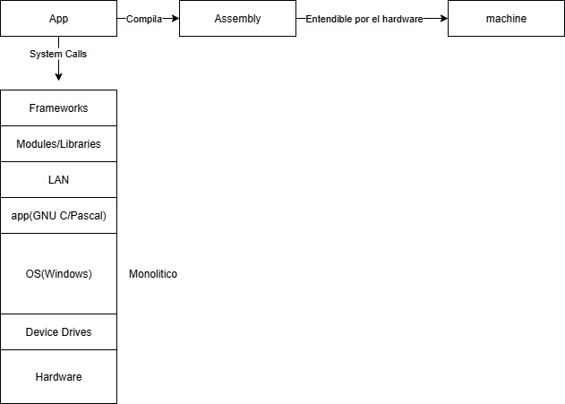
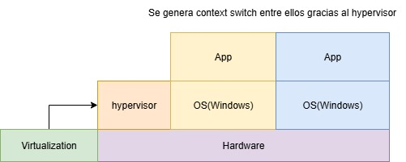
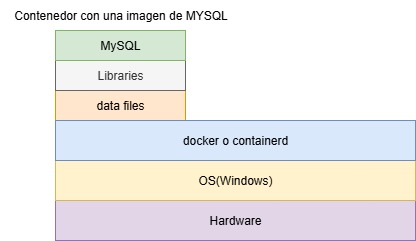
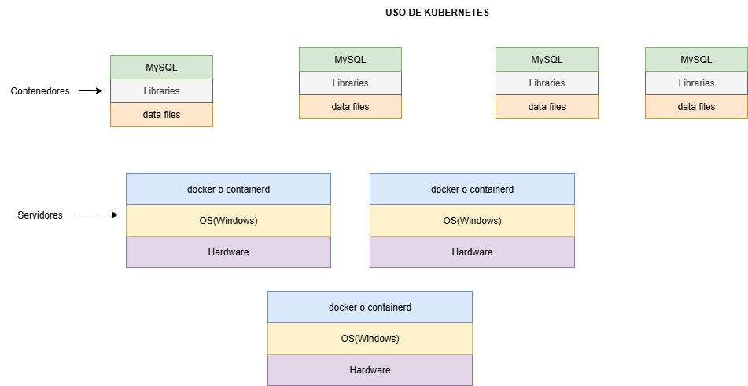
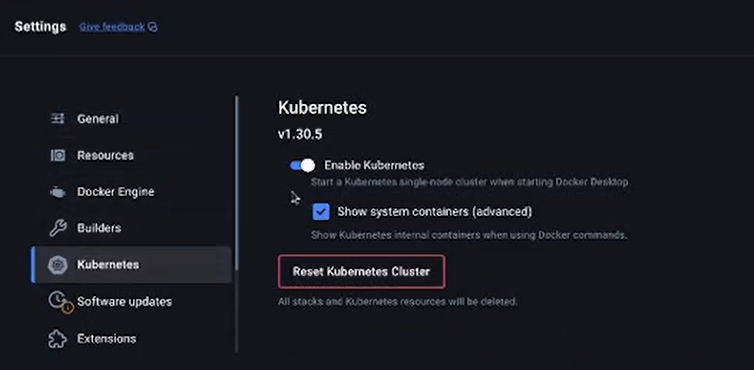
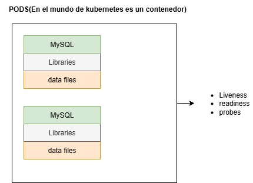
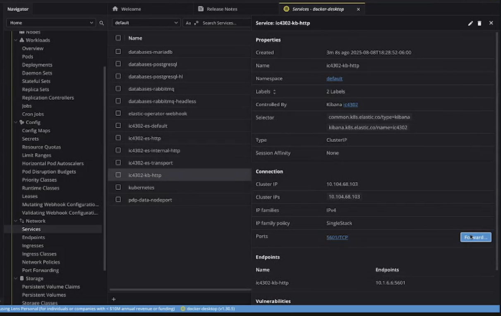
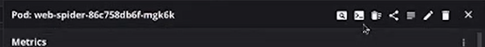
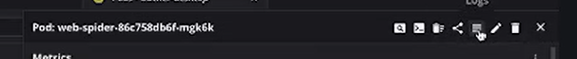
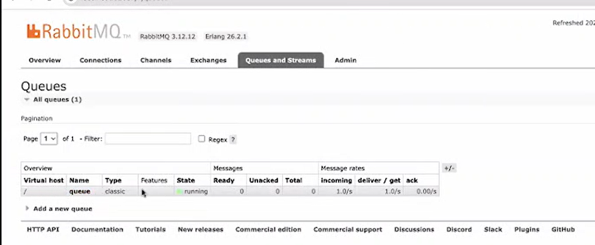

# ¿Como surge Docker?
---
## Definición de computador



1. **Hardware**  
   Aquí se encuentran los transistores, tarjetas, y el movimiento de datos mediante pulsos.

2. **Assembler**  
   Permite comunicarse con el hardware (ejemplo: NASM), ejecuta instrucciones propias de la arquitectura (CPU) y otros componentes.

3. **Device Driver**  
   Necesarios para interactuar con periféricos como una llave maya. Estos drivers son sencillos de instalar pues el SO ya tiene drivers para interactuar con ellos.

4. **OS (Operating System)**  
   Establece interfaces para que los programas interactúen con el hardware. Gobierna todas las funciones del computador, usualmente visto como un sistema operativo monolítico.

5. **App**  
   El programa se compila, genera lenguaje ensamblador, luego lenguaje máquina (1s y 0s) que el hardware interpreta.

> [!CAUTION]  
> La app no puede correr directamente sobre el hardware porque, si se corren dos aplicaciones simultáneamente, podrían acceder al direccionamiento de memoria, caché, disco, etc., que está usando la otra app.

6. **Lenguajes de Alto Nivel (LAN)**  
   Surgen por la complejidad de programar en lenguajes bajos. Tienen paradigmas más sencillos pero menor control sobre el computador y menor eficiencia.

7. **Modules/Libraries/Packages**  
   Bloques de código en LAN que permiten reutilización. Son pesados porque incluyen funciones no siempre usadas.

8. **Frameworks**  
   Liberan a los desarrolladores de escribir mucho código, abstraen funcionalidades complejas para hacerlas más fáciles de entender.

### Sistema Operativo Monolítico

- El SO es muy grande y monopoliza todos los componentes.
- Solo un programa puede ejecutarse por CPU a la vez.
- Tiene funcionalidad general, pero puede ser tedioso solicitar permisos para funciones.
- Consume mucha memoria.

#### System Calls
Es la forma que permite interactuar con el SO. Son operaciones de bajo nivel que se le pide al SO que las ejecute por uno.

---
## Uso de más de un SO en un hardware físico
Surge de la necesidad de utilizar distintos SO, ya que anteriormente estos tenian que ser desinstalados para instalar el SO que se necesita.

### Dual Boot
Permite tener mas de un sistema en la misma maquina, pero no corren al mismo tiempo.

### Virtualizacion
Uno de ellos es VMWare que permite tener hardware virtual, el cual implementa el mismo hardware real. Con ello se puede utilizar mas un SO al mismo tiempo. Basado en el ciclo de fetch, comienza a ser scheduling.

#### Scheduling
Encargado de manejar la ejecucion de las tareas de las aplicaciones, esto es consecutivo no es paralero. Con este proceso y utlizar VMWare se realiza un scheduling extra a nivel del hardware virtual, como desventaja representa bajo rendimiento. 
Es decir se tiene "2 computadoras", y una ejecucion de una aplicacion corriendo en una VM suelen tener una penalidad de rendimiento.

#### File Descriptors / Pipes / Streams -> Input/Output Streams
Son los mecanismos de interaccion aceptados por los programas. Me permite mover o obtener datos, ademas de operaciones matematicas. Es decir mover informacion entre diferentes dispositivos.

---
Surge el problema de necesitar un hardware dedicado por aplicacion solucionandolo con virtualizacion pero se hacia sumamente lenta.



#### Virtualizacion a nivel de hardware
Tecnologia incorporada en los procesadores la cual puede ser activada. Genera que se cree un SO pequeno conocido como  **HyperVisor**

##### HyperVisor
Un SO que permite hacer virtualizacion, conocido como **micro-kernel**

###### Micro-Kernel
Este es distino al monolitico, pues se delega todas las funciones que antes eran del SO. Su funcionalidad es simple, realiza el scheduling de maquinas virtuales parecido a un timer, este cada cierto tiempo de dispara indicandole a los SO virtuales que estan sobre el hardware que se ejecuten. 
Tiene el tamano y codigo necesario para hacer el trabajo. Se hace mas rapido ejecutar mas de un SO en un mismo hardware.

##### Sistema monolitico como SO virtual
Al ser monolitico aunque sea virtual, siempre va a tener la necesidad de cargar bibliotecas, apps entre otros necesarios para la ejecucion aunque no se utilice.

###### Context Switch
Se da nivel operativo y utlizando el hypervisor, se da cambios de SO y al mismo momento se tiene que cambiar toda la memoria y mover informacion grande el context switch es pesado. 
Esto se encuentra en todos los momentos ya que sucede con cada cambio de SO para ejecutar sus tareas, entre mas pesado el SO mas caro el context switch. Y esto por que se tiene SO solo para ejecutar una sola.



---
### Docker/Containerd
Surge al no ver sostenible la virtualizacion. 


Son softwares de contenerizacion, se crea contenedores que contenga solo lo necesario, por ejemplo SQL SERVER solo si se necesita la app. 

#### Contenedor
Se organiza en capas.

1. Software a correr (capa superior)  
2. Librerías o módulos necesarios (capa intermedia)  
3. Datos que se quieran correr (capa inferior)  

Con esto, el peso reduce bastante a diferencia de tener SO virtualizados, y al momento de hacer un context switch se hace unicamente de las cosas necesarias para ejecutar el contenedor. 


Es una version empaquetada de la aplicacion con las librerias faltantes para correr en lo comun que tiene el SO sobre el que se esta corriendo.

##### Ventajas
- Virtualización ligera o contenerización  
- Solo se cambia el tamaño del contenedor, no todo el SO

Para usar docker, se crea o utiliza imagenes que empaquetan toda la aplicacion y se ejecutan en un contenedor, tratando de ser lo mas rapido posibles, pues entre mas pequenos los contenedores, mas rapido el context switch y por ende la ejecucion es sumamente mas rapida. 

---
### Kubernete
Proyecto de Google para orquestar contenedores Docker, solucionando problemas como la caída de contenedores.

- Orquesta grupos de servidores con Kubernetes instalado.
- Asigna contenedores al mejor servidor.
- Asegura que los contenedores estén siempre corriendo, puede mantener múltiples versiones.



Permite tener grupos de servidores en los que esta instalafo Kubernetes y en los que tiene contenedores creados. Kubernetes va a buscar el mejor servidor para correr el contenedor y si se cae se va a asegurar de que este corriendo, puede correr n versiones de contenedores asegurandose que siempre van a correr.

###### Servicios y productos que corren contenedores

- Serverless
- EKS
- AKS
- GKE
- Fargate
- CloudRun
- Lambda
- ECS


# Explicacion del Proyecto Base 

```plaintext
PO
├── README.md
├── charts
│   ├── application
│   ├── bootstrap
│   ├── databases
│   ├── install.sh
│   └── uninstall.sh
├── docker
│   ├── build.sh
│   ├── downloader
│   ├── spark-job
│   └── web-spider
├── images
│   └── docker-desktop-k8s.png
└── utils
    ├── sample
    └── sample.scala

```

## Uso de Docker
Se debe acceder a docker hub y crear una cuenta, en la cual se puede ver los contenedores e imagenes onlines

### Docker hub
Respositorio de imagenes de la comunidad, se puede encontrar imagenes que se necesiten. O se pueden crear las imagenes. Hay varios repositorios, publicos y privados con manejo de permisos.

Por defecto, las imagenes personales son publicas, asignadas con un TAG el cual indica la version de imagen.

Al momento de instalar Docker Desktop es importante activar los kubernets, encontrado en la seccion de ajustes. 



### Kubectl
Es una linea de comando para interactuar con kubernets

### Helm
Herramienta que permite instalar y orquestar aplicaciones.

### Lens
Muestra la instalacion de docker junto los kubernets. Brinda informacion del estado de la memoria y otros componentes y recursos asignados. 
###### Namespaces
Se encuentran los namespaces que hay por defectos los mas relevantes son:
- kube-node-lease
- kube-public
- kube-system

###### Workloads - Pods
Aqui se podra ver los pods que monitorea kubernet, si alguno se cae, kubernet se encarga de levantarlo, se puede visualizar la informacion del mismo asi como la lista de contenedores que se estan corriendo.
Los pods utilizan una imagen que se descarga, asi como limites de memoria, cpu entre otros.



En el mundo de kubernetes es un contenedor. 
Como se visualiza en el diagrama, es una coleccion de contenedores, el cual permite tener liveness, readiness and proobes permite monitorear que el pod este saludable, y si un pod se cae se puede volver a levantar.

---
Dentro de la siguiente carpeta se encuentran imagenes de docker que se van a construir en el PO:

```plaintext
   ├── docker
   │   ├── downloader
```

Por ejemplo, downloader es una imagen que permite descargar cosas.

#### Agregar una imagen de Docker que se esta creando
Es importante recordar que docker tiene capas o layers enpaquetando lo mas pequeno posible.

##### Downloader
Se despierta cada vez que hay un mensaje nuevo y muestra que es lo que esta recibiendo.

```plaintext
   ├── downloader
   │   │   ├── app
   │   │   └── Dockerfile
```

Al trabajar con capas, se debe asignar una imagen base, en este caso es python 3.12.4, las imagenes slim son las que tienen menos biliotecas

```dockerfile
FROM python:3.12.4-slim-bookworm
```
Representa otra capa en la imagen que es crear una carpeta.

```dockerfile
WORKDIR /app
```
Se agrega una capa extra que copia lo que esta dentro de la carpeta app en la imagen
```dockerfile
COPY app/. .
```

Para correr el codigo, se debe actualizar la imagen de python basada en ubuntu, instalando lo necesario.
```dockerfile

RUN apt-get update -y
RUN apt-get install -y libmariadb-dev #Bibliotecas de desarrollo maria DB
RUN apt install build-essential -y #Me permite compilar
RUN apt install wget -y
RUN pip install --no-cache-dir -r requirements.txt

CMD [ "python", "-u", "./app.py" ]
```
Se estara utilizando **pika y mariabd** para interactuar con la cola de mensajes que es rabbitMQ.

##### Web Spider
Crea mensajes que van a ser un archivo json.
Utilza las imagenes bases iguales al Downloader

##### SparkJob

Esta imagen, utiliza una imagen base de java11, asi como correr Scala y Spark

```dockerfile
# Imagen base de Apache Spark 3.5.1 con Scala 2.12 y Java 11 sobre Ubuntu
FROM spark:3.5.1-scala2.12-java11-ubuntu
# Referencia: https://stackoverflow.com/questions/27717379/spark-how-to-run-spark-file-from-spark-shell

# Directorio de trabajo dentro del contenedor
WORKDIR /app

# Copia una app Scala de la aplicación
COPY app/app.scala .

# Copia un jar que representa una biblioteca necesaria
COPY app/elasticsearch-spark-30_2.12-8.14.3.jar /opt/spark/jars/

```
Este contenedor corre un cronjob y por ende debe terminar en algun momento
```dockerfile

#CMD [ "tail", "-f", "/dev/null" ]  # (opción para mantener el contenedor vivo sin hacer nada)
CMD ["ls", "-l", "/tmp"]
```

---
## Como subir las imagenes?

```plaintext
   ├── docker
   │   ├── build.sh
```

Es un script que corre en sistemas linux y mac pero se puede preparar para powershell.

Para ejecutarlo se debe en el CMD:

1. Dirigir a la carpeta docker
2. Al tener una cuenta en docker hub, se ejcuta ./build.sh nombre_de_usuario
3.Valida si esta auntenticado
4.Y comienza a construir las imagenes, logueandose a docker construyendo imagen por imagen ademas de asignarles un tag, el nombre de usuario enviado en el comando se asigna al tag representado como $1 y por ultimo sube la imagen al docker hub.

```bash
docker build -t $1/downloader .
```

## Charts
Se encarga de hacer ejecuciones de aplicaciones, es una herramienta para hacer deployments. Los siguientes archivos son helmcharts.

```plaintext
├── charts
│   ├── application
│   ├── bootstrap
│   ├── databases
```

### Estructura de un helmchart

1.Values -> Vacio porque no se necesita nada del mismo
2.Chart.yaml -> Especifica metadatos y dependencias

##### Dependencias
Software que se desea instalar 
###### eck-operator
Es una dependencia para correr elastic-search

```md
bootstrap
├── .helmignore
├── Chart.lock
├── Chart.yaml
├── values.yaml
├── charts
│   └── eck-operator-2.13.0.tgz
└── templates
```
##### Instalacion de un helmchart
Esta se hace en un cmd por medio de un comando

Los siguientes scripts representan la forma de instalar y desinstalar los helmchart.

```md
charts
├── install.sh
├── uninstall.sh
```


Al desintalar, se borran las bases de datos, y demas.
Cuando se vaya a desintalar, en Lens se debe ir al apartado **Storage-Persistant Volume Claims** y se borra los namespaces.

##### Crendenciales de las bases de datos

En lens, dentro del apartado Config-Secrets, se encuentra las contrasenas de las bases de datos para ser conectadas y utilizadas en el connection string.

##### Correr sevicios en lens
En lens, dentro del apartado Network-Services, se ven las bases de datos basadas en http, al darle click a una base de datos se presiona forward.



Muestra un login, solicitando el user y password para interactuar con la base de datos.

##### Interactuando con Pods en lens
Al entrar en un pod creado, y se presiona el icon de shell se puede interactuar por ejemplo:
- **ls** se pueden visualizar los archivos de la imagen
- **more nombre_archivo** Se puede visualizar el codigo del mismo



Al entrar al pod creado, y se presiona el icon de logs se puede ver los logs generados por el container que esta corriendo.



##### Visualizando colas de rabbitMQ
Por medio de los channels se puede ver los pods conectados quienes estan creando jobs identificados por la IP.



## Pasar passwords y users automaticamente por medio de Kubernet
Se crea dentro del contenedor una variable de entorno que represente el user o password de la base de datos que pertenezca.

```md
application
└── templates
    └── producer.yaml
```
Dentro del archivo se le puede indicar al POD, crear una variable de entorno ademas de donde obtener el valor.

En el siguiente ejemplo, se pide el valor desde un secret llamado databases-rabbitmq de la key rabbitmq-password y ese valor se expone con el nombre RABBITMQ_PASS.
```yaml
- name: RABBITMQ_PASS
  valueFrom:
    secretKeyRef:
      name: databases-rabbitmq
      key: rabbitmq-password
      optional: false
```
## Scala
En la siguiente ruta, se encuentra informacion que puede ser util al momento de elaborar el proyectos
En el archivo sample se encuentra informacion de ejemplo que debe ser procesado con scala y spark.
```md
utils
├── sample
└── sample.scala
```
