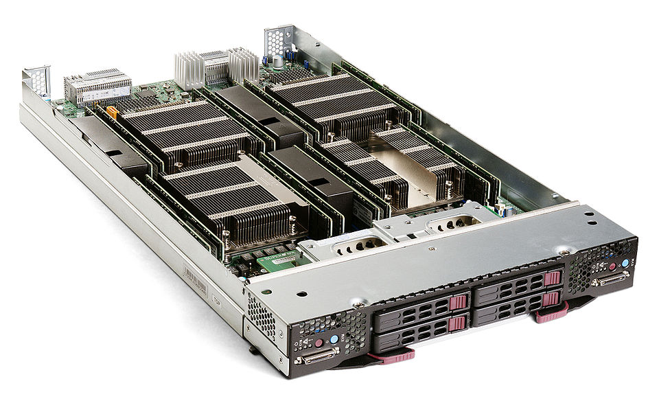
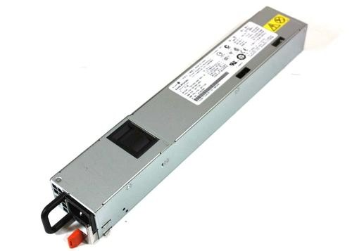
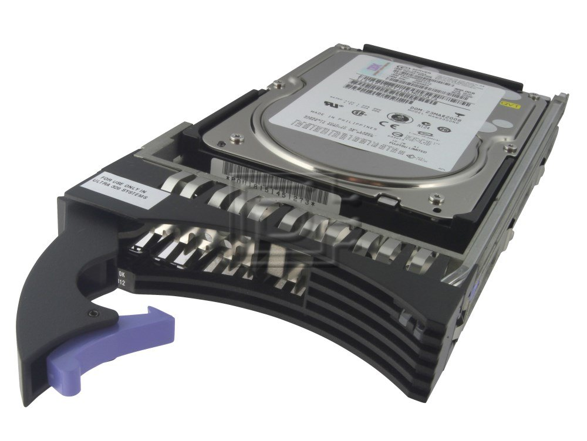
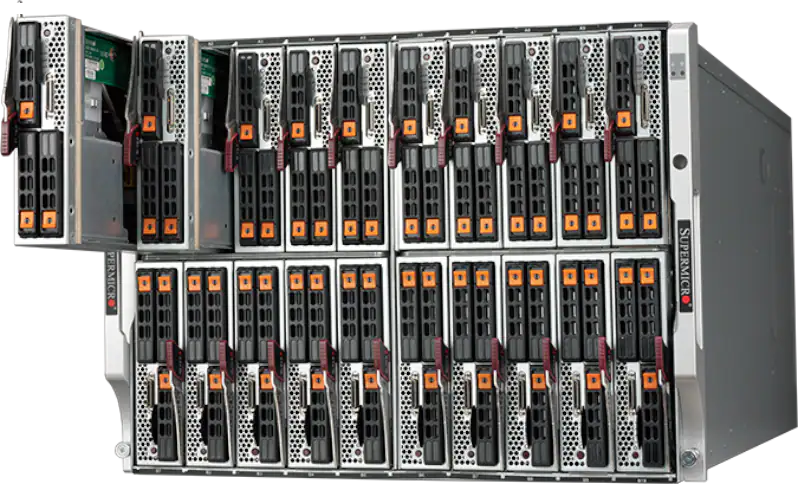

# Alta disponibilidad

Se debe asegurar que se encuentra redundacia desde el lado fisico hasta llegar a la base de datos. Y con ello asegurarnos que el cliente puede utilizar esa redundancia.

### A nivel de hardware/fisico

Se puede conocer a nivel de hardware y a nivel físico. 

**Blade Server**

**US ->** Se mide en unidades, por ende el termino US se mide en que tan alto es el server, son las cabidades dentro del rack, normalmente los rack son de 60 US y en cada US puedo poner un servidor. 

**RAID CONTROLLER->** Estos dispositivos tienen varias ranuras para meter discos y se les llama RAID Controller permite obtener los discos del servidor y hace pensar al SO que se tiene solo un disco. Permitiendo que funcionen como espejo para que 2 de los 4 discos puedan replicar a los otros, en caso de fallar puede hacer un fail over automatico.

**A nivel de procesador** estos dispositivos tienen mas de de 1 pues al tener varios en caso que falle 1 este podra utilizar otro y el servicio va a seguir funcionando. 

**A nivel de la memoria** si se tiene n ranuras me permite tener disponibilidad a nivel de memoria, podre tener redundacia ya que las memorias estan separadas y tendre un doble, si tengo 64G el SO asume que hay 32G pues los otros 32 son replica.

**A nivel de fuente de poder** si alguna llega a fallar estas puede remplazarse automaticamente. Normalmente se tienen 2 pegadas a la alimentacion y si alguna se dana se cambia, tienen interfaces de observabilidad. Esto se rienen que conectar a proveedores disitintos de electricidad.

---
1. Me permite hacer una redundancia y duplicidad de componentes,por aquello de que el dispositivo puedan fallar. 

2. Estos dispositivos alertan la degradacion del servicio anos antes de que lleguen a danarse.

### SCSI Disks
Son de forma plug and play, tienen un seguro para que no se puedan extraer, suelen ser muy costosos.

### Cabinets o dispositivos de blade server

Funcionan para almacenar los blade server, tienen una funcionalidad de plug and play en caso de que uno se dane este se mueve a otro. Si el cabinet tiene 20 servidores el mismo funciona como 1 sola entidad, sin un blade se dana este se extrae y el cabinet se mueve a otro.

### Network Interface

**Redundancia a nivel de red→** A nivel de un Data Center con ayuda de un switch (Dispositivos fisicos que me permiten tener comunicacion con las tarjetas de RED). 

---
Diagrama 1

Se debe tener switches independientes que se conecten a tarjetas de red independientes, pues si una falla habra otro para trabajar asegurando redundancia.

**UPS →** Baterias que me permite que la computadora trabaje sin conexión a internet cierto tiempo asi como evitar picos de electricidad, además es comun que la fuente de poder se comunique con el servidor por medio de un UPS para evitar que la tarjeta se queme. Además si nota que la fuente se cae, hacen un fail over automatico, permite que el UPS entre a funcionar. En un DataCenter son de gran tamano.

**Redundancia a nivel de proveedor de internet →** Se realiza comunicación al server por medio de un switch, en caso de uno se caiga aseguro que el server tenga acceso a otro.

### Sistema Espejo

Este permite redundacia y duplicidad de sistemas, donde se deben estar separados entre rack, si un rack llega a fallar el otro sistema podra continuar pues el otro esta en distinto rack. Esto para tener un servicio con altamente disponible, por ello, se debe tenerlos fisicamente separados.

Digrama 2

### Zone Awareness

Las bases de datos replica (Secundaria) y la primaria se encuentran en distintos servidores fisicos para mantener la alta disponibilidad. Me garantiza que no van a estar juntas en un servidor fisico. Estos pueden trabajar en relacion con el SLA definido y la configuracion que se tiene que hacer.

Con ello se tiene redundacia a nivel fisico en la misma ubicacion geografica.

---

### Redundancia a nivel a de ubicacion geografica / datacenter

Es util tener misma replicacion en datacenter, replicas en distintas ubicaciones geograficas, estas pueden ser a nivel de region, pais, etc. Se duplica todas las redundancias en datacenter distintos.

---

# Data Tiers

Se tiene una base de datos primaria y secundaria con la finalidad de replicacion, ambas del mismo tamano. Si la primaria se cae, la secundaria empezara a recibir las consultas y se convertira en primaria.

Diagrama de bases replication-------------------------

**Problematica** → Duplicidad de recursos disponibles que se estan desperdiciando
**DataSet->** Datos que tengo en el sistema

#### Partitions/Shards/Slice/Chunk
Se realiza particiones del dataset.
Parten en pedazos el dataset y distribuirlo para hacer una optimizacion de consultas y provecho de hardware disponible.

diagrama 3-------------------

Normalmente se hacen via caracterisitica de los datos, por ejemplo, puedo clasificar los dataset para cada particion. Como se ve en el diagrama alguno puede ir para la particion donde los datos tienen un id menor a 2002.

**Problematica →** Si se tiene una consulta de busqueda la misma se va a los dos servidores donde retornan los datasets en cada servidor, al final estos se unen y se envian al cliente. Si se tienen n particiones se deben unir las n, dentro de los problemas se tiene complejidad

### Que son las data tiers?

Se manejan estandares segun los recursos y metricas de la base de datos. Por ejemplo:
- 1:30 = Content (hot)
- 1:60 = Warm
- 1:120 - Cold
- ... Frozen
  
Se tiene un mapeo o relacion de **#GB de RAM : #GB de Disco**

Es importante para una clasificación de datos, entre la memoria sea mas pequena y el disco mas grande se puede llegar a tener pages fault y por ende mas context switches.
Entre mas baja las relaciones los pages hit aumentan y las paginaciones son mas rapida, pues no hay que hacer tantos cambios de contexto. La resolucion de consultas llega a ser mas rapida.

Se le asigna diversos serivdores asignados con los estandares mencionados anteriormente, donde se distribuye cada dataset particionado en cada servidor(data tiers) segun sus caracateristicas.

Se tiene un control de usuario activos segun su solicitud de les asigna una base de datos donde los recursos se relacionen a la eficiencia necesitada para ese usuario en especifico, por ende se particionan los datos. Casa servidor tienen costos distintos y por ello se ahorra mas dinero pues los usuarios que casi no usan el sistema sale mas barato que los servidores hots. Donde su hardware determina que tan rapido va a ser la consulta.

DIAGRAMA ------------ DE BASES

Se espera como caso perfecto 1:1 (mismo tamano de disco y memoria) pero este es bastante caro, si son casos pequenos se puede llegar a un 1:1 barato.

---

### Compliance a nivel de bases de datos

Se debe cumplir con el protocolo de seguridad de datos, se puede hacer particiones en relacion a la locacion de usuarios, ademas se puede usar zone awareness en relacion a su locacion geografica.

---

## Data Network

Si se tiene una base de datos primaria dentro de un servidor, en caso de haber una solicitud con retraso pues la red este saturada, habra un retraso en el envio de la informacion (Delay en la respuesta del usuario), esto se tiene que revisar que este en buenas condiciones. Se ve afectado el tiempo subsecond.

**Bandwidth →** Cantidad de datos que puedo pasar por unidad de tiempo. Esto esta definido por las tarjetas de red que tienen los servidores.

**Storage Area Network/ SAN / NAS->** Son dispositivos en rack y medidos por US, donde tienen n discos duros, se conectan atraves de la red, crea discos hacia los servidores de las bases de datos y fisicamente los datos de los mismos viven dentro del SAN.

Entre mas solicitudes el bandwidth aumenta y la comunicacion entre las bases primaria y secundarias se dificulta, hasta llegar aun punto donde el SAN esta operacional y las bases de datos tambien pero la red esta saturada.

diagrama 

**Man in middle**
Es alguien que esta viendo lo que para por la red y descargar los paquetes de red, es peligroso, por ello las bd siempre tiene  que estar aisladas.
Existen cerficaciones que miden la seguridad a nivel de sistemas como lo es IS0 27001 o SOC2.

DIAGRAMA

Cada base de datos se comunica entre ellas y por otro lado se comunican con los datos almacenados me garantiza que la red de datos esta totalmente aislada y solo se usa para mover datos del almacenamiento hacia el servidor. Y la red normal se usa para comunicarse entre las bases de datos y mover clientes. Si hay un man in the middle no va a poder capturar datos.

### Load Testing
Envia o reproduce el comportamiento de un usuario a una base de datos y con ello usamos el sistema de observabilidad.

Con ello se obtiene el comportamiendo de un usuario y al mismo se le llama **WorkLoad**, luego, con el workload que se grabo se replica con n usuarios y se observa la respuesta y uso de recursos.

Diagrama

##### Beneficios
1. En las bases de datos me ayudan a determinar cual es el peor caso y con ello establecer limites para vender el producto con SLA con limite de usuarios. 
2. A nivel de observabilidad puedo definir una alerta que se dispare si sobrepasa el limite se usuarios.
3. Puedo usar las alertas para hacer un autoscaling y anadir mas recursos para que el sistema pueda soportar la carga, y cuando la alerta baje, se haga un scale out.

### Object Storage
Este concepto se relaciona con data tiers. Dentro de un file system se tiene conceptos de folders, pages etc y de ahi se tiene un Direct Memory Access el cual se conecta a los archivos. Se puede hacer Random Access a los archivos. 

Es un servicio de intercambio de archivos usando HTTP, cuando hay un disco duro conectado, el mismo se conecta via directa, donde la interfaz de hardware me permite comunicarme, y asi tener un formato de datos amigables esto es costoso...

El intercambio de archivos se hace via red, esto causa que haya competencia de recursos de internet, y el detalle es que los datos que estan en el object storage se deben traer todo los archivos completos en vez de una pagina, esto es sumamemente lento, pero ayuda a tener alamacenamiento masivo con alta disponibilidad. Y me permite reducir costos.

### Read Replica
Se tiene una base primaria y una o mas datos secundarias en recover mode, la app se va a conectar a la primaria y si falla se realiza un switch over. Es comun que las secundarias se comporten como read replica.

Diagrama

El concepto quiere decir que la read replica se encuentra en linea, conectada a la primaria y se le coloca el load balancer, donde todo lo que son reads se envian a la replica y lo que son updates se envian a la primaria cuando son recibidos.

Se puede tener replicas primarias y secundarias, ya que me permite reducir costos ya que voy a usar todos los recursos disponibles.

### Synchronized Clocks
El cpu de una maquina se sincroniza con el cpu de otra maquina y esto de forma virtual es imposible. Permitiendo hacer operaciones atomicas.

### Sistema Multi Master
Se tienen dos servidores master que se comunican con la app por medio de un load balancer, el mismo envia a ambos servidores pueden modificar al mismo tiempo un dato con eso genera inconsistencia, el mismos utiliza **Leader Election y Concensus** esto permite entre servidores el envio de peticiones generando un delay al cliente. 

Diagrama

### Cloud Providers

**Region->** Ubicacion geografica grande como pais, continente etc, y se considera apta para uso cuando al menos tiene 3 availabity zones(data center), si hay un sistema computacional el sistema tiene un nodo en cada zona, y entre ellas tiene que haber distancia de 100 km, y con ello aumenta la alta disponibilidad.

DIAGRAMA

Para hacer sistemas altamente disponibles se duplican sistemas en distintas regiones.

### Bare Metal
Significa instalar la base de datos directamente en el hardware. Se tiene que instalar el servidor, configurarlo y asegurarse que este altamente disponible. Pues se tiene que enfocar en todos los temas dedicados al hardware. Esta practica es remplazada con el cloud provider.

### On-Premise
Es todo lo que esta instalado en infraestructura que no es cloud provider, puede ser un bare metal pero tambien puede llegar a se collocation.

**Collocation->** Contrata un data center que tiene cubierta la parte de seguridad y venden un rack. Se usa usualmente en industrias que tienen restricciones donde los datos no pueden salir.

### IaaS (Infraestructure as a Service)
Es el procesos de crear una red y una virtual machine o instancia, esto en vez de comprar todos los componentes, se contra el servicio en proveedores coimo AWS/GCP/AZURE.

#### Manage Services
Cuando se paga al cloud provider(IaaS), el mismo se encarga de Instalar. configurar, manetener y monitorear el servicio. Solo nos encargamos de administrar los datos.

### PaaS (Platform as a Service)

Es el proceso de comprar un servicio por ejemplo una cuenta de AWS junto al servicio de la base de datos donde se indica nada mas que recursos se necesitan y con ello se entrega un connection string. Asegura que la plataforma esta disponible sin saber como se maneja por detras la base de datos.

### SaaS (Software as a Service)
Se cobra por el servicio en relacion a los recursos que va a utilizar, sin preocuparse por la configuracion. Por ejemplo el pago de una plataforma por n usuarios asegurandose que siempre va a funcionar, sin detalles extras de como esta funcionando.