# Mongo ATLAS
#### 07/10/2025
---
## Uso de JSON en las bases de datos documentales

JSON es el formato que utiliza JS para manejar objetos. Antes se ocupaba aplicar parseo, para traducir entre lenguajes (XML a JSON), aumentando la carga entre las bases de datos. Por ello se decidió manejar JSON en web services.

---

1. Permite tener un almacenamiento de datos en disco.
2. Transmitir datos sin necesidad de tantas transformaciones y con ello se reduce el uso de CPU y memoria de web services, cliente, etc.

Las bases de datos pueden tener un lenguaje de intercambio de datos → las bases de datos utilizan, por ejemplo, un mecanismo binario para intercambio de datos: toma el SQL, lo compila en binario y se lo envía al destino, que lo traduce a una representación interna del lenguaje de programación o de la base de datos.

Es decir, existen etapas de parsing de documentos en los lenguajes de programación.
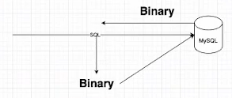

---

Decidieron usar los web services como lenguaje de intercambio de datos y convertirlo en el lenguaje que usa la web. El protocolo HTTP (texto) es un lenguaje en texto con caracteres visibles de la tabla ASCII. Con ello termina siendo un documento JSON.

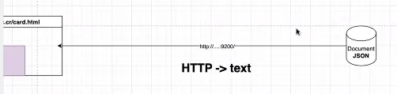
---

## Document Model

Corazón de las bases de datos documentales. Basados en modelos key-value pairs, son campos únicos que representan la base de datos y se pueden mapear a un booleano, string, number, array u objeto (JSON anidados).

 - Empiezan y terminan con una llave.
 - Representación de los datos como documento JSON.
 - Puede agregar campos de forma dinámica; es decir, pueden tener distintas formas.
  

La base de datos documental se basa en el document model, y él se encarga de hacer la representación en formato JSON.

1. Se puede modificar la estructura del documento y modificar esquemas.
2. Los documentos pueden tener diferentes campos.
3. Se puede representar cualquier tipo de dato; se tiene una cuota máxima de 16 MB: los docs mayores a 16 MB no se pueden almacenar dentro de Mongo.
4. Cuando se tiene volúmenes grandes se suele tener datos binarios (imágenes, videos, audios, archivos ejecutables, algún tipo de archivo custom (zip, tar)) — cualquier archivo que no se pueda leer en texto plano.
5. Cuando se tiene datos binarios en un JSON, se puede convertir el dato en Base64: tomar una representación binaria y convertirla en una representación en texto, es decir, codificar la información en los 64 caracteres visibles de la tabla ASCII.
    
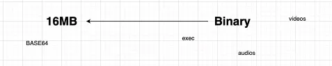
    

Mongo va a guardar los datos como string, y si se desea buscar esos datos Mongo no los va a identificar.

### GridFS

Permite guardar archivos y datos grandes en un file system. Esto teniendo en cuenta cómo hacer el almacenamiento de los datos.

### Object Storage

Almacenamiento de documentos, como un S3.

---

Al tener datos de JSON que contienen binarios, se divide los datos binarios y los JSON. Para unirlos, el binario se guarda en un object storage que genera una URL, y la URL se guarda en el documento JSON; es decir, se tiene una referencia de dónde se guarda el archivo. Con ello, los documentos van a tener fields sencillos de buscar.

Es importante tomar en cuenta los caracteres que contienen los documentos, pues los mismos se traducen en bytes y se deben almacenar. Puede generar desperdicio de almacenamiento. Al tener los archivos uno por uno en un folder es ineficiente para la base de datos.

### Alternativa

Tomar un solo archivo donde se colocan los documentos JSON uno tras otro, conectados al siguiente. Cuando se necesite recuperar docs se abre un solo archivo y se recorre.

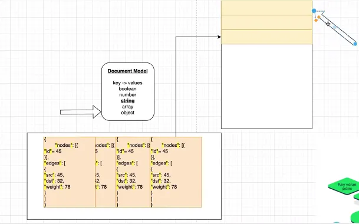

Cada uno de los documentos van a ser un JSON, terminan y empiezan con llaves. Por ello se tiene que contruir un metodo que recorra el archivo e identifique donde empieza y termina cada documento. 

#### SCAN

Puede ser leyendo fila por fila o byte por byte interpretando los datos hasta encontrar lo que se buscaba. Es el método menos deseado y en el peor de los casos está de último. Revisa cosa por cosa hasta encontrar lo que se busca y, en el peor de los casos, no es amigable para el almacenamiento de los datos.

### BJSON / Binary JSON

Es un formato que suele ser grande. Sucede cuando, a la hora de construir el documento, se busca una forma en la cual se pueda convertir el doc en una representación de documento más amigable.

#### Codificación de un documento JSON

En BJSON se tendrá 4 bytes que representan el tamaño del registro. Es decir, se convierte el doc en un registro.

- Tendrá 1 byte que representa el tipo de field.

- Tendrá 2 bytes que representan el name del field. El nombre de un campo termina siempre en 0x00, el cual es el terminador de campo.

- Tendrá 4 bytes para representar el valor del campo. A bajo nivel se maneja en **little endian**.
- Termina el registro con 0x00.
- Por último define el size del archivo, que está al inicio.

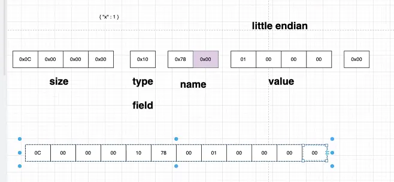

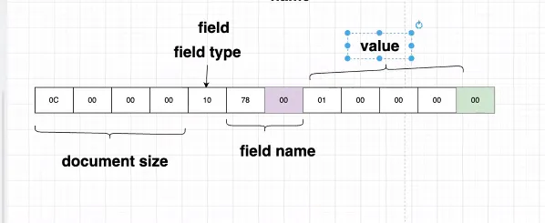

El verde representa un terminador de clave y el morado un terminador de documentos.

Esto facilita pues el manejador del almacenamiento de Mongo lee los caracteres necesarios, moviendo el puntero del disco de 12 en 12 caracteres, por ejemplo, según la necesidad de la posición del manejador.

Hace los saltos más eficientes, pues no revisa byte por byte para saber dónde inician los documentos. Como se codifican todos con un tamaño fijo:

- Mongo se caracteriza por tener esquema flexible; es decir, los documentos de distintos tamaño, al saber el size del mismo se leen los primeros 4 bytes y así no hay necesidad de buscar los corchetes de cierre como en el método de scan.

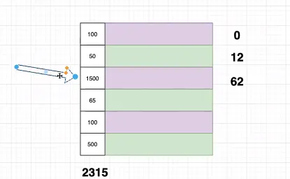

##### Nombre del campo

Al ser datos largos, Mongo aplica una simple compresión de los mismos. Con ello, codifica los nombres para tener un nivel de compresión en el tamaño de los field names, pues el field name es repetido y no va a cambiar.

1. Con el uso de codificación de nombres se genera un nivel de compresión en el tamaño de los field names; se pasará de tener 4 campos a solo 1 campo.
2. Reduce la cantidad de info y la cantidad de veces que se accede a buscar información, pues se tiene una tabla que resume toda la información.

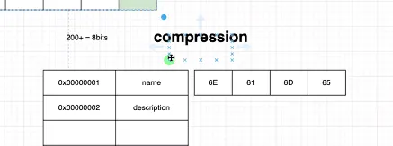

---

##### WireTiger

El binary JSON se usa a nivel de motor de base de datos. En Mongo se usa WiredTiger. Él se encarga de manejarlo, organizarlo, etc. Este es un manejador de Mongo que consume mucha memoria, pues intenta mantener toda la info en memoria principal para reducir las entradas a disco; es por ello que se debe configurar bien para evitar que se infle la memoria principal.

###### Tratamiento de los datos binarios para realizar una búsqueda

Los datos binarios no son sencillos para realizar búsquedas. Cuando se tiene una imagen se debe pasar por un OCR (hace el reconocimiento del documento), se extrae el texto que hay en la imagen, se puede obtener la URL y además se guarda en el documento el texto extraído para que, cuando haya procesos de búsqueda, puedan buscar sobre imágenes.

Cuando se habla de videos funciona igual, pues un video es un conjunto de frames/imagenes. La diferencia es que se tiene el tiempo en que el texto aparece por medio de metadatos (datos de los datos).
El audio se pasa por un proceso speech-to-text.

---

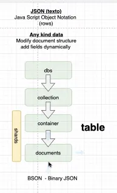

Mongo a referirse a una bd se habla de coleccion, tabla se habla de contendor la cual contiene documentos, row se habla de documento.

---

### RAW Dataset

Permite dividir los datos.

##### Shards

Se maneja **shard key** → define cómo una unidad se rutea o se guardan los datos. Se les establece id a los documentos; cuando Mongo los recibe podrá saber en qué shard guardarlo. Los shards son réplicas que se guardan en nodos de Mongo.

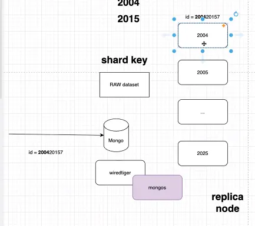

##### Chunks
Se les asigna chunk, que tiene un límite de tamaño. Automáticamente WiredTiger divide el chunk en dos si este sobrepasa el límite de tamaño. Se basa en la cardinalidad de los datos con subdivisión de los mismos con el mismo shard key del principal.
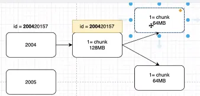

Entre más chunks se tenga va a ser más fácil leerlo completo y subirlo a memoria.

### JUMBO

Es un chunk muy grande que quedó así pues el shard key no le permitió hacer la subdivisión de los datos.

Cuando se ve un shard que no está creciendo mucho, Mongo analiza si se puede hacer un reshard y mover chunks para enviarlos a shards que no están en uso.

Si el shard se hace muy grande, las consultas van a redirigirse a esos nodos buscando recursos y los pequeños van a estar desperdiciando recursos.

Es decir, se hace un balanceo de shards.

---

### Tipos de servidores

##### Replica Set

No se tiene el concepto de shard. Es decir, cada uno de los servidores va a tener el 100% de los datos, siendo copias idénticas de los mismos.

##### Replica Set Sharded

Se puede escoger cuánta réplica de los datos por shard se puede tener por servidor. Se puede definir la porción de los datos que tendrá cada shard; aumenta velocidad pero pierde disponibilidad.
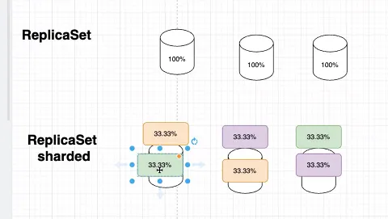