# Indexing

Se hace un SCAN (equivalente a un O(N), pues en el peor de los casos se tiene que hacer N comparaciones para saber si un dato buscado está en los datos).

Se utilizan índices para solucionar esto; funcionan como estructuras de datos que permiten optimizar el tiempo de búsquedas, además del tiempo de inserción y el tiempo de búsqueda.

Al momento de insertar, el motor sabe que se debe mover por la estructura de datos.

Estructura de datos que me permite organizar los datos para optimizar las búsquedas, borrados, actualización. El único afectado es la inserción, pues al insertar en un simple archivo se haría un simple append, pero si se tiene un índice se debe mover por la estructura de datos para saber en qué ubicación queda el registro.

Cuando se tiene una base de datos con un alto volumen de escrituras lo mejor es desactivar el indexamiento justo en el momento que se sabe cuándo se realizan las escrituras, pues conlleva muchas verificaciones y balanceo de estructuras indexadas.

Cuando se activa de nuevo la inserción, se activa la indexación y con ello se hace un nuevo balanceo de la estructura de datos.

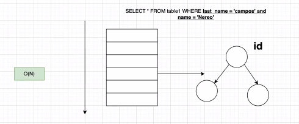

---

### Clustered Index

Es la estructura de datos que se va a crear dentro del archivo de datos. Hay que tener cuidado con seleccionar las columnas, pues solo puede existir un clustered index por cada base de datos.

Esto se hace por un análisis de workload para saber cuáles son las consultas que se ejecutan más. Y con eso definimos el clustered index sobre la columna(s) que más se usan en selects.

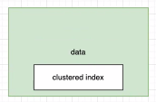

### Non Clustered Index

Todas las consultas secundarias que no se utilizan tanto, dentro del registro del índice se tendrá la columna sobre la que se está haciendo el almacenamiento, se tendrá un apuntador al hijo derecho y al hijo izquierdo y además, una representación del parent.

- El registro quedaría conformado por 44 bytes + pointer, el cual representa apuntador al archivo de datos. Si llego a encontrarlo se va al index file a buscar el registro, guarda la posición, y abre el data_file y recorre con el puntero a la ubicación que se recibió para recuperar la información.

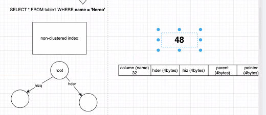
---

### Uso de datos y almacenamiento

Cuando se hace un non-clustered index se debe duplicar la columna name y además crear la información que va a soportar la estructura. Y entre más índices tenga en la base de datos más datos se van a tener repetidos.

Si el storage aumenta y no se aumenta la memoria, el memory/dist ratio va a aumentar, es decir, la cantidad de gigas por memoria va a aumentar y entra en juego el SO. Es decir, aumenta la probabilidad de que haya un page fault o un cache fault, usando interrupciones o direct memory access. Generando **context switches**, despertando al sistema operativo.

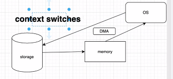

Memory footprint → Cantidad de operaciones que hago usando la memoria

Se puede tener en una misma tabla los clustered y non-clustered index.

---

## Hash Index

Buckets → Canastos donde se va a guardar la información para organizarla. Estos se pueden enumerar.

Función de hash → Es una función que recibe una clave, columna o valor y me reproduce un identificador de bucket.

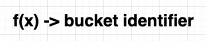

Colisión → En las tablas de hash se tiene manejo de colisiones, verificación si los buckets cercanos están ocupados o también se puede manejar otro tipo de estructura de datos dentro de cada bucket para llenar con los datos que tengan el mismo bucket identifier, **índice multibinario**. Se tiene ciertos niveles y tiene sentido cuando se conoce bien la estructura de los datos que se están insertando.

Si se tiene un árbol completamente balanceado, podrán entrar cada vez más registros almacenados en cada nivel.

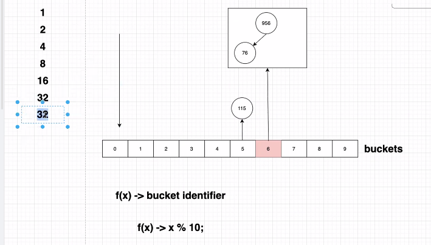

En el peor de los casos que tenga muchos elementos se tendrá que hacer 10 comparaciones para insertar o darme cuenta que un elemento no está en el árbol.

En cada comparación se van descartando elementos y me quedaré con la comparación de árboles más pequeños. Puede haber mejoría en tiempos de búsqueda.

Es una función de hash que se define en una de las columnas, de la cual se conoce la distribución de datos y con la tabla reduzco la cantidad de datos y puedo conocer la ubicación del dato con una sola operación.

### Complexity Binary Search btree b+tree

Se va reduciendo el tiempo en el que voy a tardar reduciendo la cantidad de operaciones. Tendrá un O(1), pues el tiempo de búsqueda es constante.

### INCLUDE

Este es de mucho cuidado, al usar include el uso de memoria, CPU, etc. aumenta. Se puede especificar qué otras columnas que no forman parte del índice quiero incluir en el índice. Se tiene el dato listo para ser utilizado en vez de recuperar el puntero y recolectar la información.

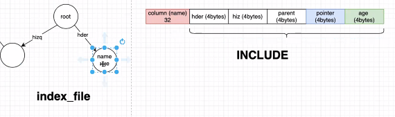

Si se busca un dato, inicia desde el elemento buscado hasta recuperar todos los datos en orden.

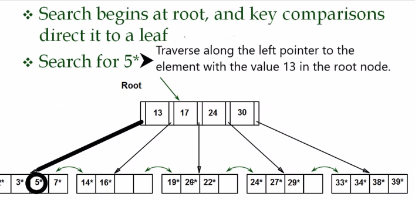

En las sentencias puede llegar a aumentar la velocidad dependiendo del tipo de index que se esté utilizando.

---

Entra transacción → Escribe transacción al binary log → Procesa la transacción → Hace commit a disco → Escribe a binary log el commit.

Entre más índices tenga y me entra el volumen de inserciones, estas aumentan mucho el tiempo y si el memory footprint es muy alto se hacen muchas operaciones del SO. Aumentando la cantidad de tiempo que voy a durar haciendo el procesamiento de la base de datos.

Si desactivo los index el tiempo de procesamiento va a bajar, pues los datos entran rápido a la base de datos con commit. La base de datos seguirá en funcionamiento, solo se diferencia en que los datos se van a encontrar más lento, pues es una búsqueda de registro por registro. Luego se activa el indexamiento.

---

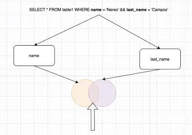
## Expression Index

Cuando se hace una búsqueda por expresión, se guarda el resultado de hacer la expresión sobre la columna que se necesita.

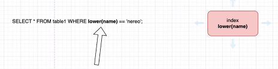

En el peor de los casos, sin un índice se deberían de ejecutar 1 millón de veces la expresión, pero si se tiene la expresión indexada esta no se va a ejecutar. Teniendo el elemento que se va a usar en una consulta precalculado.

## Partial Index

Cuando se está conociendo la estructura y hay un comportamiento en el workload que una porción de los datos se estén consultando mucho a diferencia de otra porción de los datos.

Para mantener una buena salud del storage contra la memoria se utiliza un índice parcial definido basado en una expresión que identifique una porción. Por ejemplo, indexar los datos con id mayor a 2017. Es decir, el tamaño del index_file va a ser más pequeño y no aumenta tanto el memory footprint. Pues el mayor comportamiento viene de las personas que están indexadas.

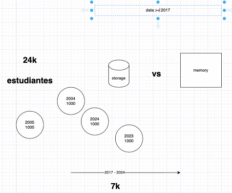

# Recomendaciones al trabajar con indexación

1. No definir más índices de lo necesario
2. Tener los índices pequeños
3. Mantener los índices en memoria principal

Se podrá dar respuesta a consultas rápidas sin despertar al SO, acceder al almacenamiento, etc.