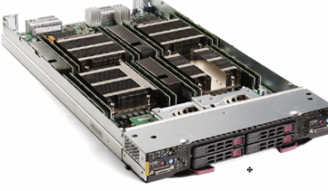
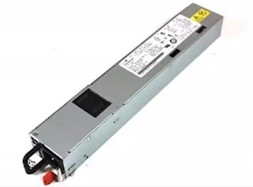
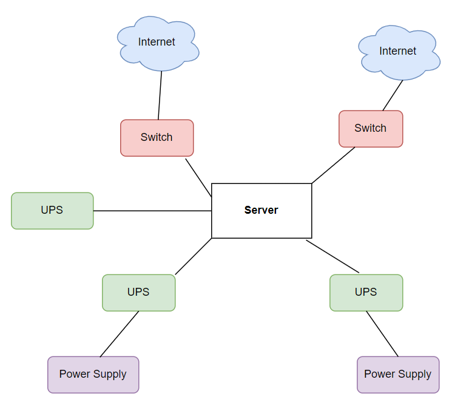
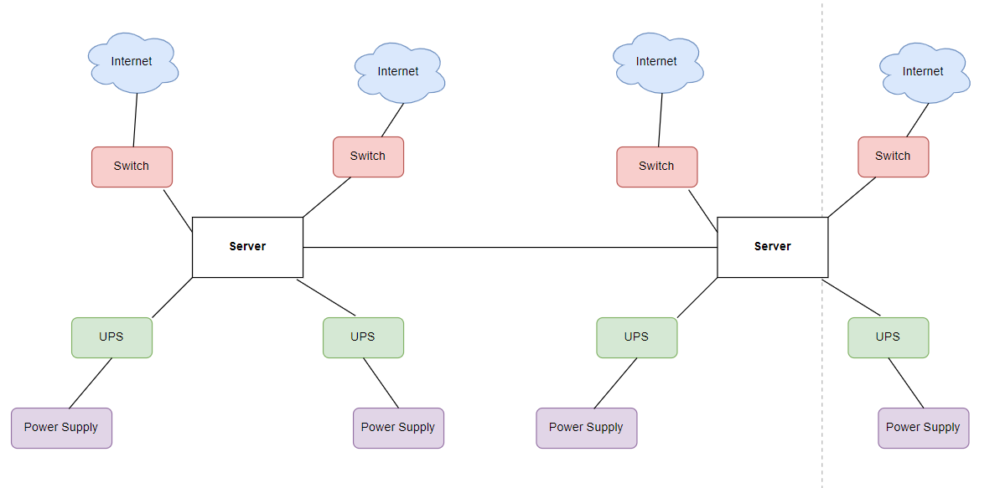
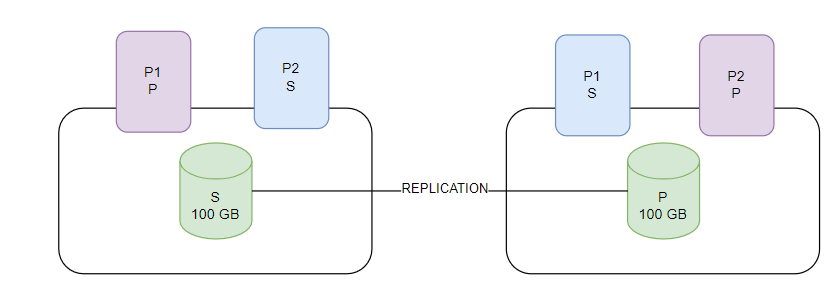

## Apunte 1
### Priscilla Romero Barquero - 2023332718
---

## Alta Disponibilidad

La **alta disponibilidad** debe garantizarse en primer lugar a nivel de **hardware**, especialmente en los datacenters.

#### Blade Server y unidades Us

En los datacenters se utilizan Blade Servers, los cuales se miden en una especie de unidades llamadas Us.  El término Us hace referencia a qué tan alto es el servidor en términos físicos dentro de un rack.  

Por ejemplo, si tenemos un rack Dell, este es un gabinete con rodillos o platinas donde se insertan los aparatos.  Un rack de 60 Us puede alojar varios servidores, y cada servidor se inserta como si fuera un disco en una ranura.  Los Us representan la altura del dispositivo (Blade Server) y determinan cuántos equipos se pueden montar en un rack.
  

  

#### Almacenamiento y RAID Controller

Los Blade Servers tienen ranuras para insertar discos, y dentro de ellos incluyen un componente llamado RAID Controller.  Este controlador administra todos los discos del servidor y puede hacerle “pensar” al sistema operativo que solo existe un único disco, aunque realmente haya varios.  
Un ejemplo común es cuando se configuran los discos para que se comporten como un espejo (mirroring) dodne dos discos replican la información de otros dos y de esta forma, los datos siempre están duplicados.

#### Failovers 

Cuando se hace la replicación de un disco contra otro, si alguno falla ocurre un failover automático.  Esto significa que el sistema comenzará a trabajar inmediatamente con el disco que todavía funciona, sin interrumpir el servicio.  

Este mecanismo permite:  
- Recuperarse de posibles fallos a nivel de disco.  
- Garantizar la continuidad de la operación.  
- Contribuir a la alta disponibilidad desde el nivel más básico del hardware.
  
La alta disponibilidad no solo se garantiza a nivel de discos, también aplica a otros componentes como los **procesadores**.  Estos dispositivos suelen tener más de un procesador, si uno falla, el otro sigue funcionando sin que el sistema se detenga, es decir, se aplica el mismo principio que con los discos: redundancia para evitar caídas.  
Lo mismo sucede a nivel de **RAM**, por ejemplo, si un servidor tiene 64 GB de RAM, las ranuras estarán partidas en dos grupos. El sistema operativo asume que solo tiene 32 GB activos, mientras que los otros 32 GB están en espera para activarse en caso de que ocurra un fallo y permite que la memoria continue auqnue alguna ranura falle.  
A nivel de **poder**, los servidores Blade cuentan con algo llamado Blade Server Power Supply, normalmente tienen dos fuentes de poder conectadas a la alimentación y sii una se daña, simplemente se reemplaza y el servidor automáticamente empieza a trabajar con la otra, manteniendo el servicio sin interrupciones.  
  

También tienen redundancia a nivel de **tarjetas de red**, siempre van a tener gran cantidad de ranuras para tarjeta de red.

#### Redundancia en Red

En un datacenter existen dispositivos físicos llamados **switches**, los cuales manejan la conectividad de red Y Para asegurar alta disponibilidad:  
  - Se deben usar tarjetas de red independientes en el servidor.  
  - Cada tarjeta debe conectarse a switches diferentes e independientes.  
  - De esta forma, si un switch falla, la otra conexión entra en funcionamiento automáticamente.

#### Redundancia en Energía (Power Supply)

Al igual que con la red, el suministro de energía también requiere redundancia.  Las fuentes de poder deben estar conectadas a proveedores eléctricos redundantes o diferentes. Así, si un proveedor falla, otro puede seguir alimentando al servidor sin interrupción.

#### UPS

Es común el uso de UPS (baterías) en los datacenters.  Estas se colocan entre el servidor y la corriente eléctrica. Sus funciones principales son:  
  - Mantener funcionando el servidor por un tiempo limitado en caso de pérdida de energía.  
  - Absorber picos de corriente para evitar daños en los equipos.  
  - Proteger tarjetas de red y demás componentes sensibles.  
Además, las UPS permiten un failover automático, si se detecta que una fuente de poder se cae, la UPS entra a trabajar de inmediato.

Si se cuenta con redundancia a nivel de **hardware**, **red**, **fuentes de poder** y **proveedores**, se garantiza una **alta disponibilidad integral** en el datacenter.  
  

También es importante recalcar que si construimos un sistema computacional la idea es tener un **sistema espejo** que funcione en caso de uno se caiga también y la idea es que cada uno de estos estén en diferente rack y dando garantía que estén físicamente separados.  

---
## Zone Awareness en Bases de Datos

El concepto de Zone Awareness significa que una base de datos debe tener copias replicadas en un esquema de alta disponibilidad. De esta manera, en caso de fallo, la base de datos pueda seguir funcionando gracias a la replicación.  
Además, es importante que la base de datos secundaria no se encuentre en el mismo servidor que la principal, ya que la base de datos secundaria (réplica) debe estar lista para asumir el trabajo si la principal falla.  

---

## Particiones/Shards/Chunks

Imagine que tiene dos bases de datos con el mismo tamaño, que hay un servidor con la BD principal y otro con la BD secundaria. Si la base principal se cae, la secundaria empieza a atender consultas y se convierte en la nueva base de datos principal.  

El problema de este enfoque es que, al duplicar los recursos disponibles, una parte importante de ellos termina desperdiciándose. Para evitar esto, se aplican **particiones o shards** dentro del dataset.  

Un ejemplo sería tener una base de datos de **100 GB** y dividirla en varias partes: **Partición Principal 1**, **Partición Principal 2**, **Partición Secundaria 1** y **Partición Secundaria 2**. Estas particiones se pueden distribuir en diferentes servidores, de manera que todos trabajen en paralelo y se aproveche mejor el hardware disponible.  

La forma de partir los datos depende de una característica del dataset. Dependiendo de los registros y queries que se hagan, basta con redireccionarla a la partición adecuada. Esto permite que los dos servidores procesen al mismo tiempo y que los recursos de hardware sean utilizados al máximo.  

En general, partitions y shards permiten dividir el dataset, distribuirlo y optimizar tanto las consultas como el uso del hardware.  

#### Cuál es el problema?

El problema es que cuando entra una consulta que involucra varias particiones, cada servidor ejecuta su parte, genera resultados y finalmente hay que unir esos resultados. Esta unión puede ser un proceso complejo y costoso, ya que requiere consolidar información que proviene de diferentes partes de la base.  

Este problema abre la puerta a la necesidad de aplicar un enfoque más estructurado: los **Data Tiers**.  

## Data Tiers

Un sistema con Data Tiers organiza las consultas y los datos en distintos niveles. A nivel de base de datos suelen manejarse métricas que relacionan la memoria RAM con la cantidad de almacenamiento en disco:  

- Hot tier (1:30) → por cada 1 GB de RAM, 30 GB de disco.  
- Warm tier (1:60) → por cada 1 GB de RAM, 60 GB de disco.  
- Cold tier (1:120) → por cada 1 GB de RAM, 120 GB de disco.  

Esta relación es importante porque determina el rendimiento del sistema. Cuanto más grande sea el disco en comparación con la memoria, mayor será la probabilidad de que ocurran page faults. Un page fault implica que el sistema operativo tenga que hacer un context switch, despertar procesos y traer información desde el disco, lo cual es más lento. En cambio, si la relación de disco por memoria es menor, los page hits aumentan, y las consultas pueden responderse mucho más rápido.  

#### Clasificación 

El uso de **Data Tiers** también permite clasificar los datos según su nivel de uso:  
- Hot data (muy usado).  
- Warm data (uso medio). 
- Cold data (sin uso). 

Separar la información en estas categorías asegura que los datos más importantes se mantengan en entornos de alta velocidad, mientras que los menos relevantes pueden almacenarse en niveles más lentos pero más económicos.  

---

## Compliance

A nivel de bases de datos existen legislaciones de compliance que deben cumplirse. Un ejemplo muy conocido es el GDPR (General Data Protection Regulation), que corresponde a la regulación de protección de datos de la Unión Europea.  Este tipo de normativas establecen lineamientos sobre cómo se deben almacenar, procesar y proteger los datos de las personas.  

Para ajustarse a estas legislaciones, es común aplicar estrategias en la infraestructura de bases de datos:

- *Partitions según ubicación geográfica:* los datos pueden dividirse en particiones basadas en la región de la persona. De esta manera, se garantiza que la información de un usuario se almacene en el país o zona donde legalmente debe permanecer.  

- *Zone Awareness:* se utilizan configuraciones que distribuyen los datos en diferentes zonas geográficas. Esto asegura no solo la **redundancia y disponibilidad**, sino también el cumplimiento de las normativas locales de almacenamiento y procesamiento.  

---

## Data Network

En todo sistema distribuido existe una red que actúa como medio físico de comunicación entre los diferentes componentes. Es fundamental garantizar que esta red esté en buenas condiciones y evitar que se sature, ya que de ella depende el correcto funcionamiento del sistema.
Toda red tiene asociado un parámetro llamado **bandwidth**, que representa la cantidad de datos que pueden transmitirse por unidad de tiempo.  El medio físico de la red, junto con las tarjetas de red utilizadas, son los que determinan el ancho de banda disponible.  

#### Storage Area Network (SAN / NAS)

En el contexto de las bases de datos y los sistemas de alta disponibilidad, existen dispositivos llamados **Storage Area Network (SAN)** o **Network Attached Storage (NAS)**.  Estos dispositivos se montan en racks con una altura medida en **Us** y contienen grupos de discos duros.  Se conectan a los servidores a través de la red, lo que permite que los servidores de bases de datos utilicen los discos que forman parte de este almacenamiento compartido.  
Esto sirve para que en lugar de que cada servidor dependa únicamente de discos internos, se conectan a un SAN/NAS y acceden a recursos de almacenamiento a través de la red.

---

## Object Storage

El concepto de Object Storage se relaciona con el manejo de datos y con los Data Tiers. 

En un sistema tradicional de archivos (file system), los datos se organizan en folders y files, que a su vez se dividen en páginas de memoria.  Cuando el sistema operativo procesa datos, el DMA (Direct Memory Access) realiza el movimiento de páginas entre la memoria principal y el disco.  Este modelo de almacenamiento en disco tiene una característica importante: ofrece Random Access, es decir, se puede acceder directamente a un fragmento del archivo sin necesidad de leerlo completo.

#### Entonces qué es Object Storage?

El Object Storage cambia este enfoque al tratarse como un servicio de intercambio de archivos vía HTTP. Funciona de manera similar a cómo se accede a una página web, pero en este caso para subir y descargar archivos completos. Por ejemplo, los datos no están en un disco conectado directamente al servidor y se acceden a través de la red e internet, lo que implica competir con el tráfico de red y depender de tarer los datos de una ubicación remota.  el acceso es más lento comparado con tener un disco local.
Sin emabrgo, ofrece ventajas como tener almacenamiento prácticamente ilimitado ya lta disponibildiad.  

Los servicios de Object Storage están disponibles con proveedorres de nube:  
- **Amazon S3** en AWS.  
- **Azure Blobs** en Microsoft Azure.  
- **GCS (Google Cloud Storage)** en Google Cloud.  

---

## Read Replica

Las bases de datos secundarias se comportan como read replica, lo que significa que están online igual que la base primaria. Una vez que ambas están en línea, entre ellas se ubica un componente llamado load balancer que se encarga de enviar todas las operaciones de lectura (reads) hacia la read replica, mientras que las operaciones de escritura (updates) se dirigen al primario y posteriormente fluyen hacia la réplica cuando son recibidas.  

Este esquema permite aprovechar el hardware disponible en las réplicas y, si además se combina con el uso de particiones, se pueden distribuir las réplicas primarias y secundarias en distintos servidores. De esta manera se logra atender consultas de forma más eficiente y reducir costos, sacando el máximo provecho del hardware.  

En general, una read replica permite aumentar la capacidad de lectura que tiene el sistema computacional, lo que a su vez incrementa la cantidad de usuarios que se pueden tener.  

---

## Sistema Multimaster

Cuando se trabaja con un sistema multimaster se tienen varios servidores configurados como master al mismo tiempo. A través del load balancer se pueden enviar actualizaciones o cambios hacia ambos servidores, pero como los dos pueden modificar el mismo recurso compartido simultáneamente, esto puede provocar que la base de datos quede en un estado inconsistente.  

Para que un sistema multimaster funcione correctamente es necesario implementar un proceso de **leader election** y un mecanismo de **consensus** entre los servidores. Sin embargo, esto genera una gran cantidad de mensajes para lograr que todos se pongan de acuerdo, lo que a su vez introduce un delay para el cliente al momento de procesar las solicitudes.  

---

## Bare Metal
Se refiere a instalar directamente la base de datos en el hardware. Esto significa que se toma un servidor, se instala el sistema operativo y, una vez hecho esto, se instala y configura la base de datos de forma manual.  En este esquema es necesario encargarse por cuenta propia de asegurar la redundancia, la conexión a internet, los switches y todo lo que requiere la infraestructura para garantizar la alta disponibilidad.  

Con la llegada de los cloud providers, este modelo prácticamente ya no se utiliza, ya que la nube abstrae y automatiza estos procesos.  

---

## Cloud Providers

Los cloud providers ofrecen infraestructura y servicios que antes se debían montar manualmente en servidores físicos.

Un cloud provider divide su infraestructura en regiones, que son ubicaciones geográficas muy grandes, como un país, un conjunto de países o incluso un continente completo.  

Para que una región sea considerada apta para bases de datos y alta disponibilidad, debe contar con al menos tres availability zones (AZs). Cada availability zone corresponde a un datacenter independiente y deben estar separados por al menos 100 km entre sí.  Así, se garantiza que en caso de un desastre natural que afecte a una zona, las otras puedan seguir funcionando sin interrumpir el servicio.  

Los cloud providers ofrecen modelos de servicio:

- **IaaS (Infrastructure as a Service):** El proveedor entrega servidores, almacenamiento y redes virtuales. El usuario se encarga de instalar y configurar el sistema operativo y las aplicaciones.  

- **PaaS (Platform as a Service):** El proveedor entrega la infraestructura y además el sistema operativo, las herramientas listas para desplegar aplicaciones. El usuario solo se preocupa por el código.

- **SaaS (Software as a Service):** El proveedor ofrece una aplicación completa lista para usar y el ususario nada más la usa por internet.

