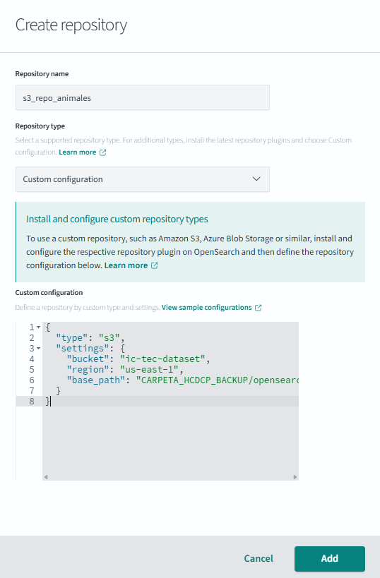
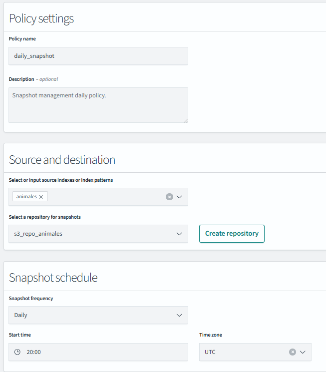
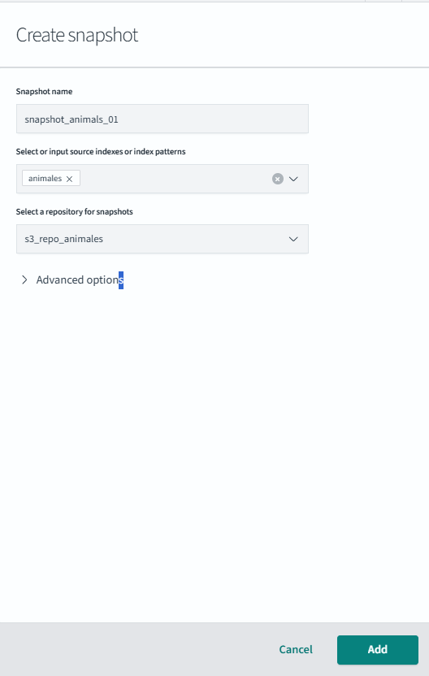
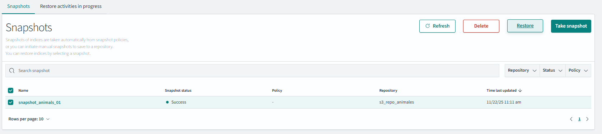
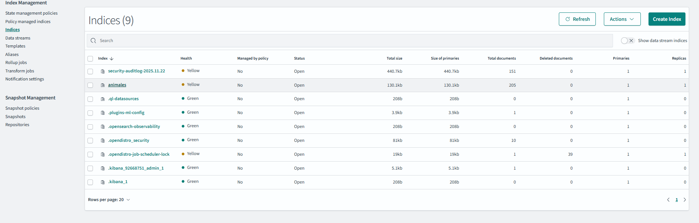
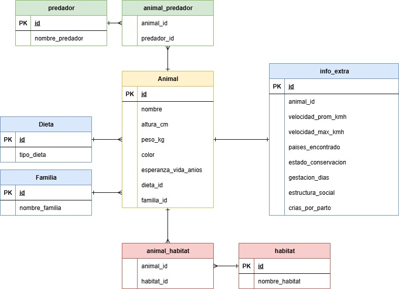

# IC4302 - Tarea Corta 02

**Curso:** Bases de Datos II (IC4302)  
**Semestre:** Segundo Semestre 2025  
**Institución:** Tecnológico de Costa Rica – Escuela de Ingeniería en Computación  


# Instrucciones de Ejecución
  
<details>
  <summary>Desplegar información</summary>

#### Prerrequisitos
1. Tener instalado y configurado Helm en tu máquina local.
2. Tener acceso a un clúster de Kubernetes configurado correctamente.
3. Asegurarte de que el archivo `values.yaml` esté configurado para habilitar las bases de datos.

#### Pasos de Instalación

1. **Clonar el repositorio:**
   ```bash
   git clone https://github.com/usuario/2025-02-IC4302.git
   cd 2025-02-IC4302
   ```

</details>


# Pruebas realizadas
  
<details>
  <summary>Desplegar información</summary> 

## OpenSearch

<details>
  <summary>Desplegar información</summary> 

### Backup

#### Crear un repositorio de Snapshots
1. **Accede a OpenSearch Dashboards:**
   - Abre tu navegador y ve a `http://localhost:5601` (o la URL de tu OpenSearch Dashboards).
   - Inicia sesión con tus credenciales (usuario: `admin`, contraseña: configurada en `values.yaml`).

2. **Navega a la sección de Snapshots:**
   - En el menú lateral izquierdo, selecciona `Stack Management`.
   - Haz clic en `Snapshot and Restore`.

3. **Registrar un repositorio de Snapshots:**
   - Haz clic en el botón `Register a repository`.
   - Llena el formulario con la siguiente información:
     - **Name:** Escribe un nombre para tu repositorio, por ejemplo, `opensearch-backup`.
     - **Type:** Selecciona `s3`.
     - **Settings:** Copia y pega la siguiente configuración:
       ```json
       {
         "bucket": "ic-tec-dataset",
         "region": "us-east-1",
         "base_path": "CARPETA_HCDCP_BACKUP/opensearch"
       }
       ```
   - Haz clic en `Register` para guardar el repositorio.

#### Crear una política de Snapshots
1. **Configura una política automática:**
   - En la sección de `Snapshot policies`.
   - Haz clic en `Create policy`.
   - Llena el formulario:
     - **Policy name:** Escribe un nombre, por ejemplo, `daily-backup-policy`.
     - **Repository:** Selecciona el repositorio que creaste anteriormente.
     - **Snapshot name pattern:** Usa un patrón como `backup-{now/d}` para incluir la fecha.
     - **Schedule:** Configura la frecuencia, por ejemplo, `0 0 * * *` para un respaldo diario.
   - Haz clic en `Create` para guardar la política.

#### Crear un Snapshot manual
1. **Crear un Snapshot:**
   - En la sección de `Snapshots`, haz clic en `Take snapshot`.
   - Llena el formulario:
     - **Snapshot name:** Escribe un nombre para tu respaldo, por ejemplo, `manual-backup-2025-11-22`.
     - **Indice:** Selecciona el indice animales que se cargo previamente.
     - **Repository:** Selecciona el repositorio que creaste anteriormente.
   - Haz clic en `Create` para iniciar el respaldo.

#### Video Tutorial: Backup
[Video Tutorial Backup](https://estudianteccr-my.sharepoint.com/:v:/g/personal/c_araya_1_estudiantec_cr/IQAfcYrbk1oXTL6trnzClrIGAbmJuR4u9XHA3SHv_pXTLGs?e=8rYv8L)

---

### Restore

#### Restaurar un Snapshot
1. **Accede a la sección de Snapshots:**
   - En el menú lateral izquierdo, selecciona `Stack Management`.
   - Haz clic en `Snapshot and Restore`.

2. **Selecciona un Snapshot:**
   - En la lista de Snapshots, busca el respaldo que deseas restaurar.
   - Haz clic en el botón `Restore` junto al Snapshot.

3. **Configura la restauración:**
   - Selecciona los índices que deseas restaurar (o deja la configuración predeterminada para restaurar todo).
   - Haz clic en `Restore` para iniciar el proceso.

#### Verificar que el índice se generó
1. **Revisar los índices restaurados:**
   - En el menú lateral izquierdo, selecciona `Index Management`.
   - Busca el índice restaurado en la lista.
   - Verifica que el estado sea `green` y que los documentos estén disponibles.

#### Video Tutorial: Restore
[Video Tutorial Restore](https://estudianteccr-my.sharepoint.com/:v:/g/personal/c_araya_1_estudiantec_cr/IQDzQoSEYJTISKNhhRWvBSXFAbV8wnKG5Mh3IXik2qSTIjQ?e=kYmJRZ)

---

- **Crear repositorio:** 
 
  

- **Política de Snapshots:** 
  
  

- **Crear Snapshot:** 
 
  

- **Restaurar Snapshot:**
  
  

- **Verificar índice:** 
  
  
  
</details>

## Elasticsearch  

<details>
  <summary>Desplegar información</summary>

Para el desarrollo completo al realizar backups y restauraciones de indices en Elasticsearch se utiliza el servicio de Kibana al cual puede ingresar utilizado la interfaz de Lens y en la sección de Services. Una vez dentro utilizaremos su robusta configuracion de Backups y restauración  


[Video Tutorial Backup y Resturación](https://estudianteccr-my.sharepoint.com/:v:/g/personal/d_romero_estudiantec_cr/IQAnJWdoFvZgSZf6dMdVND21AfEHQfBwu7Fp6b7Z5F4D0Nk?nav=eyJyZWZlcnJhbEluZm8iOnsicmVmZXJyYWxBcHAiOiJPbmVEcml2ZUZvckJ1c2luZXNzIiwicmVmZXJyYWxBcHBQbGF0Zm9ybSI6IldlYiIsInJlZmVycmFsTW9kZSI6InZpZXciLCJyZWZlcnJhbFZpZXciOiJNeUZpbGVzTGlua0NvcHkifX0&e=FnbWrc)

### Backup  

### Configuración del snapshot repository  

Para realizar todo el procedimiento es necesario crear un Snapshot Repository, el cual es una ubicación externa donde elasticsearch puede crear y almacenar respaldos de sus indices, para poder crearlo solo debe ingresar al servicio de kibana (implementado en este proyecto) por el cual se puede interactuar con elasticsearch.  En kibana ---> Stack Management ---> Snapshot y Restore ---> Repositories ---> Register repositories .  Este repositorio incluye distintos parametros, para el caso de esta tarea, se deben ingresar los siguientes:

| Parámetro | Valor |
|----------|-------------|
| name | elastic |
| provider | AWS |
| client | default |
| bucketName | ic-tec-dataset |
| base_path | CARPETA_HCDCP_BACKUP/elastic |  

### Configuración de la política  

Una vez creado el repositorio es necesario crear una política que permite ejecutar un snapshot de forma automática cada cierto tiempo y así automatizar los backups, aqui unicamnete debe completar campos del repositorio ya creado.  

| Parámetro | Valor |
|----------|-------------|
| name | elastic |
| snapshotName | elastic |
| repository | elastic (nombre del snapshot repository creado |  

**¿Cómo ejecutar el backup?**  

Para ejecutar el snapshot que generará el backup, puede esperar a que se ejcute segun el horario que fue asignado o bien puede ejecutarlo manualmente en Kibana ---> Stack Management ---> policies y justo en la columna de actions solicita la ejecución forzadaa con el botón de run.  
Una vez ejecutado el policy, el backup empezará y podrá coprobarlo al ver una nueva carpeta dentro del prefijo especificado dentro del bucket, o bien puede ingresar a las Dev Tools de elastic y ejecutar:  

```powershell
GET _snapshot/elastic/_all
```

Donde en el resulatdo se observa cierta data que permite confirmar que el proceso fue exitoso, ya que se puede ver que parte de los indices subidos corresponde a **animals**, dataset utilizado para probar los backups

```json
{
  "snapshots": [
    {
      "snapshot": "elastic-j4wjad6lsh21ww2t5mtktw",
      "repository": "elastic",
      "version_id": 8060199,
      "indices": [
        ".kibana_security_session_1",
        ".security-7",
        ".apm-agent-configuration",
        ".kibana_8.6.1_001",
        ".apm-custom-link",
        ".ds-ilm-history-5-2025.11.21-000001",
        ".geoip_databases",
        "animals",
        ".security-profile-8",
        ".kibana-event-log-8.6.1-000001",
        ".ds-.logs-deprecation.elasticsearch-default-2025.11.21-000001",
        ".kibana_task_manager_8.6.1_001"
      ],
      "metadata": {
        "policy": "elastic"
      },
      "state": "SUCCESS",
```

---


### Restauración  

Antes de realizar el proceso para hacer la restauración de indices es importante mencionar que Elasticsearch **NO** permite restaurar un índice si este ya existe o está abierto, es por esta razón que para probar la restauración es necesario eliminar el indice `animals` antes de ejecutar el restore, utilizando este comando en la consola de Dev-Tools se puede realizar la eliminación:  

```powershell
DELETE animals
```

Una vez realizado esto puede dirigirse a Stack Management ---> Snapshot y Restore ---> Snapshots y justo en la columna de Actions seleccionar la opción `Restore`.  También es importante mencionar que al eliminar unicamente el indice animals, podremos hacer restore de unicamente ese indice, ya que los demás son los creados por el sistema y decidimos mejor no restaurarlos para evitar permisos u otros problemas que puedan surgir, por esta razón, al seleccionar esta opcion de restore, debe ajustar la configuración para que solo se haga restore del indice creado por el usuario, en este caso `animals` de esta manera:  


Una vez realzado esto puede ejecutar el snapshot completo y verificar que el indice vuelve a ser creado


---

### Crear snaphot repository  

    
  
    

### Crear politica  


### Ejecutar backup manual  


### Realizar restore  

  

  
</details>

## Mongo  

<details>
  <summary>Desplegar información</summary>  

Este proyecto implementa un sistema completo de backup y restauración para MongoDB usando AWS S3 como almacenamiento externo y Scripts Bash.  La solución permite realizar respaldos automáticos y restauraciones de la base de datos animalsdb, utilizada como dataset de prueba.

### Backup  

El proceso de respaldo se realiza automáticamente mediante un CronJob de Kubernetes que se ejecuta automaticamente cada 12 horas. El respaldo genera un archivo comprimido .gz con formato:  

```bash
YYYYmmDDHHMM.gz
```

Dentro del `values.yaml` debe estar habilitado el modulo de la siguiente manera:  

- `conectionString`: dirección interna del servicio de MongoDB.
- `bucketName`: nombre del bucket de AWS S3 donde se almacenarán los respaldos
- `path`: Rutadentro del bucket donde se guardarán/leerán los respaldos.
- `type`:
  - backup: se genera el cronjob de respaldo
  - restore: se genera el ob de restauración  

```yaml
mongo:
  enabled: true
  config:
    namespace: default
    connectionString: databases-mongodb.default.svc.cluster.local:27017
    bucketName: ic-tec-dataset
    path: CARPETA_HCDCP_BACKUP/mongodb
    maxBackups: 3
    secret: databases-mongodb
    name: "202511230002"                   # Nombre de la copia de seguridad a descargar
    schedule: "0 */12 * * *"
    diskSize: 2
    storageClass: hostpath
    provider: aws
    type: backup
```
--- 

### Restore  

El proceso de restauración se ejecuta mediante un Job que descarga el archivo de respaldo desde S3 y lo importa en MongoDB.  Este sistema permite restaurar solo la base animalsdb, evitando sobrescribir la base admin o los usuarios del clúster.  En `values.yaml` se debe utilizar el parametro `name` que define el archivo .gz a restaurar que se encuentra dentro del s3 bucket.

```yaml
mongo:
  enabled: true
  config:
    name: "202511222147"
    type: restore
```

</details>

</details>


# Configuración de componentes 
<details>
  <summary>Desplegar información</summary>  

## Llenado de las bases de datos
<details>
  <summary>Desplegar información</summary>

# Dataset de Prueba: Información de Animales

Este apartado describe el dataset utilizado como prueba en el proyecto.  
El dataset proporciona información general sobre diversas especies animales, abarcando datos físicos, ecológicos, taxonómicos y de comportamiento.  

Fuente original: [Animal Information Dataset - Kaggle](https://www.kaggle.com/datasets/iamsouravbanerjee/animal-information-dataset)

---

## Descripción General

El dataset reúne un conjunto de características asociadas a distintos animales, como su altura, peso, dieta, hábitat, depredadores, estado de conservación, entre otros.  
Este recurso fue empleado como dataset de prueba para validar funcionalidades en el proyecto, ya que contiene datos variados que permiten realizar consultas, análisis y visualizaciones desde distintos enfoques.

---

## Estructura del Dataset

El dataset está compuesto por diversas columnas (atributos) que describen a cada animal. A continuación se detalla el glosario columna por columna:

| Columna                  | Descripción                                                                 |
|---------------------------|-----------------------------------------------------------------------------|
| **Animal**               | Nombre del animal.                                                          |
| **Height (cm)**          | Rango de altura en centímetros del animal.                                  |
| **Weight (kg)**          | Rango de peso en kilogramos del animal.                                     |
| **Color**                | Colores comunes asociados a la apariencia del animal.                       |
| **Lifespan (years)**     | Promedio de años de vida del animal.                                        |
| **Diet**                 | Tipo de dieta que sigue principalmente (Ejemplo: carnívoro, herbívoro).     |
| **Habitat**              | Hábitat o entorno natural donde suele encontrarse el animal.                 |
| **Predators**            | Depredadores o enemigos naturales del animal.                               |
| **Average Speed (km/h)** | Velocidad promedio en kilómetros por hora.                                  |
| **Countries Found**      | Países o regiones donde el animal es comúnmente encontrado.                 |
| **Conservation Status**  | Estado de conservación según organismos especializados (Ejemplo: En peligro).|
| **Family**               | Familia taxonómica a la que pertenece el animal.                            |
| **Gestation Period (days)** | Rango en días del período de gestación o embarazo.                      |
| **Top Speed (km/h)**     | Velocidad máxima alcanzable en kilómetros por hora.                         |
| **Social Structure**     | Estructura social o comportamiento (Ejemplo: solitario, en grupo).          |
| **Offspring per Birth**  | Número típico de crías por evento reproductivo.                             |

---
 
# Esquema Relacional del Dataset de Animales - MariaDB

Este apartado describe la estructura de base de datos SQL diseñada para almacenar el dataset de prueba sobre animales.  
La implementación sigue un modelo relacional normalizado, con separación de entidades principales y relaciones uno a muchos y muchos a muchos.

---



---

### Mapeo de las bases documentales 
 ```json
{
  "animals": {
    "mappings": {
      "properties": {
        "average_speed_kmh": {
          "type": "keyword"
        },
        "color": {
          "type": "keyword"
        },
        "conservation_status": {
          "type": "keyword"
        },
        "countries_found": {
          "type": "text"
        },
        "diet": {
          "type": "keyword"
        },
        "family": {
          "type": "keyword"
        },
        "gestation_period_days": {
          "type": "keyword"
        },
        "habitat": {
          "type": "text"
        },
        "height_cm": {
          "type": "keyword"
        },
        "lifespan_years": {
          "type": "keyword"
        },
        "name": {
          "type": "keyword"
        },
        "offspring_per_birth": {
          "type": "keyword"
        },
        "predators": {
          "type": "text"
        },
        "social_structure": {
          "type": "text"
        },
        "top_speed_kmh": {
          "type": "keyword"
        },
        "weight_kg": {
          "type": "keyword"
        }
      }
    }
  }
 ```

</details>

## Opensearch

<details>
  <summary>Desplegar información</summary> 

### ¿Qué es OpenSearch?

OpenSearch es una suite de software de código abierto diseñada para búsquedas y análisis de datos en tiempo real. Es un fork de Elasticsearch 7.10, desarrollado por Amazon Web Services (AWS) y la comunidad, con el objetivo de proporcionar una alternativa completamente abierta y gratuita. OpenSearch permite indexar, buscar y analizar grandes volúmenes de datos, siendo ideal para casos de uso como monitoreo de logs, análisis de datos, búsqueda en aplicaciones y más.

#### Componentes principales de OpenSearch:
1. **OpenSearch:** El motor principal que permite almacenar, buscar y analizar datos.
2. **OpenSearch Dashboards:** Una interfaz gráfica basada en web que facilita la visualización y gestión de los datos almacenados en OpenSearch. Es similar a Kibana, pero completamente de código abierto.

### Configuración de OpenSearch en este proyecto

En este proyecto, OpenSearch se utiliza para almacenar y analizar datos relacionados con animales. La configuración incluye tanto el motor de OpenSearch como OpenSearch Dashboards para la visualización de datos.

#### Configuración básica en `values.yaml`
El archivo `values.yaml` contiene los parámetros necesarios para desplegar OpenSearch y OpenSearch Dashboards en un clúster de Kubernetes. A continuación, se muestra un ejemplo de configuración:

```yaml
opensearch:
  enabled: true
  fullnameOverride: "mi-opensearch"
  clusterName: "opensearch-cluster"
  replicas: 1
  extraEnvs:
    - name: OPENSEARCH_INITIAL_ADMIN_PASSWORD
      value: "BaseDatos12345!"
opensearchDashboards:
  enabled: true
  fullnameOverride: "mi-opensearch-dashboards"
  opensearchHosts:
    - "http://opensearch-cluster-master.default.svc.cluster.local:9200"
```

#### OpenSearch Dashboards
OpenSearch Dashboards es una herramienta visual que permite interactuar con los datos almacenados en OpenSearch. Con Dashboards, puedes:
- Crear visualizaciones y gráficos interactivos.
- Configurar paneles personalizados para monitorear datos en tiempo real.
- Gestionar índices y configuraciones de OpenSearch.

Para acceder a OpenSearch Dashboards, puedes utilizar herramientas como Lens para una experiencia más visual e interactiva. Lens es una extensión que permite explorar y analizar datos de manera intuitiva. Sigue estos pasos para configurarlo:

1. **Instalar Lens:**
   Descarga e instala Lens desde su sitio oficial: [https://k8slens.dev/](https://k8slens.dev/).

2. **Conectar Lens a tu clúster de Kubernetes:**
   - Abre Lens y agrega tu clúster de Kubernetes.
   - Asegúrate de que el clúster esté configurado correctamente y que tengas acceso a los recursos necesarios.

3. **Acceder a OpenSearch Dashboards:**
   - En Lens, navega a la sección de servicios.
   - Busca el servicio `mi-opensearch-dashboards`.
   - Haz clic en el botón forward para abrir el servicio en tu navegador.

4. **Iniciar sesión en OpenSearch Dashboards:**
   - Utiliza las credenciales configuradas en `values.yaml` (por defecto, usuario: `admin`, contraseña: la definida en `OPENSEARCH_INITIAL_ADMIN_PASSWORD`).


#### Advertencia
- **OpenSearch y Elasticsearch no pueden ejecutarse simultáneamente en el mismo clúster.** Asegúrate de que en el archivo `values.yaml`, la variable `enabled` de uno de ellos esté configurada en `false` si el otro está en `true`. Esto evitará conflictos entre los servicios.


</details>

## Elasticsearch  

<details>
  <summary>Desplegar información</summary>  

Elasticsearch es un motor distribuido de búsqueda, análisis y almacenamiento de datos en tiempo real. Es ampliamente utilizado en la industria gracias a su capacidad para indexar y consultar grandes volúmenes de información de manera rápida.  

Fue creado originalmente por Elastic NV y se ha convertido en uno de los sistemas de búsqueda y análisis más populares del mundo debido a su flexibilidad, escalabilidad y ecosistema de herramientas complementarias como Kibana.

### Configuración de Elasticsearch en este proyecto

En este proyecto, Elasticsearch se utilizó para almacenar, indexar y consultar información relacionada con animales, generada mediante el dataseeder. La instalación se realizó utilizando Helm Charts.

El archivo values.yaml controla la configuración del cluster y Kibana, permitiendo habilitar o deshabilitar estos servicios según se necesite.  

```yaml
elastic:
  enabled: true
  version: 8.6.1
  replicas: 1
  name: ic4302
  fullnameOverride: mi-elasticsearch
kibana:
  enabled: true
  version: 8.6.1
  replicas: 1
  name: ic4302
```

### Kibana en este proyecto

Kibana fue utilizado para:

- Consultar los índices generados por el dataseeder
- Crear el repositorio S3 para snapshots
- Configurar la política automática de backup
- Ejecutar snapshots manuales
- Realizar el proceso de restore
- Visualizar información del sistema, mappings, documentos, etc.  

Para acceder a Kibana, se utilizó port-forwarding en la interfaz provista por Lens.

  </details>

## Mongo 

<details>
  <summary>Desplegar información</summary> 

En este proyecto, MongoDB se utilizó para almacenar los datos generados por el dataseeder, específicamente la base de datos animalsdb utilizada para los procesos de análisis y pruebas. Para administrar backups y restauraciones de esta base, se creó un Helm Chart que se encarga de:  
- Generar respaldos automáticos en formato .gz
- Guardarlos en un bucket de AWS S3
- Ejecutar restauraciones controladas bajo demanda

El archivo values.yaml dentro de la carpeta de bases de datos controla la configuración del cluster, permitiendo habilitar o deshabilitar este servicio según se necesite. 

```yaml
mongodb:
  image:
    repository: bitnamilegacy/mongodb
  global:
    security:
      allowInsecureImages: true
  enabled: true
  livenessProbe:
    enabled: true
  readinessProbe:
    enabled: true
  extraEnvVars:
    - name: EXPERIMENTAL_DOCKER_DESKTOP_FORCE_QEMU
      value: "1"
```


</details>


</details>


# Conclusiones
  
<details>
  <summary>Desplegar información</summary> 

1. El proceso de realizar backups y restores con Elasticsearch evidencia que el proceso que tienen de snapshots y restore es bastante robusto y bastante facil de utilizar, es decir no deja de ser seguro para los momentos en los que la disponibilidad de los datos juega un papel critico.
2. El uso de interfaces como el dashboard de OpenSearch facilita enormemente la generación de backups y restores, ya que proporciona herramientas visuales intuitivas que permiten gestionar snapshots, configurar repositorios y restaurar índices de manera eficiente, sin necesidad de depender exclusivamente de comandos en la terminal.
3. OpenSearch es una base de datos similar a Elasticsearch, ya que ambas están diseñadas para búsquedas y análisis de datos en tiempo real. Sin embargo, OpenSearch es un proyecto de código abierto completamente independiente, desarrollado como un fork de Elasticsearch 7.10, y no incluye las características propietarias de Elastic. Además, OpenSearch pone un mayor énfasis en la transparencia y la comunidad, mientras que Elasticsearch incluye funcionalidades avanzadas bajo licencias comerciales.
4. Guardar archivos con formato YYYYmmDDHHMM.gz es una excelente opcion para facilitar la organización y trazabilidad de los respaldos.


</details>

# Recomendaciones
  
<details>
  <summary>Desplegar información</summary> 

1. Ya que elasticsearch funciona con índices que cambian de manera dinámica es bastante ventajoso apoyarse de snapshots automáticos mediante politicas que se adecuen a las necesidades del negocio y así evitar fallo o algun borrado accidental.
2. Es recomendable almacenar las credenciales sensibles, como el usuario y la contraseña de OpenSearch (OPENSEARCH_USER y OPENSEARCH_PASS), en un sistema de gestión de secretos o en un archivo de configuración seguro, en lugar de incluirlas directamente en el archivo dataseeder.yaml. 
3. Antes de realizar un backup en OpenSearch, verificar que el índice al que se le está haciendo el snapshot no sea un índice protegido o del sistema (como .security-* o .kibana-*), ya que estos índices pueden requerir permisos adicionales o configuraciones específicas. Si intentas realizar un backup de estos índices sin los permisos adecuados, el proceso puede fallar. Para evitar errores, asegúrate de incluir únicamente los índices necesarios en la configuración del snapshot o utiliza un filtro para excluir los índices protegidos.
4. Verificar que antes de realizar la ejecución de los restores en este proyecto, se encuentre habilitada la opcion de `type: restore` para que así se ejecute coreectamente este proceso asi como verificar la restauración especifica que se quiere realizar por medio de la variable `name`.


</details>

# Referencias
  
<details>
  <summary>Desplegar información</summary> 

https://docs.opensearch.org/latest/install-and-configure/install-opensearch/helm/

https://docs.opensearch.org/latest/install-and-configure/install-dashboards/helm/

https://docs.opensearch.org/latest/api-reference/snapshots/restore-snapshot/

https://docs.opensearch.org/latest/api-reference/snapshots/create-snapshot/

https://docs.opensearch.org/latest/install-and-configure/plugins/

https://www.elastic.co/search-labs/blog/how-do-incremental-snapshots-work

https://www.mongodb.com/docs/database-tools/mongorestore/

https://docs.couchdb.org/en/stable/install/kubernetes.html https://github.com/apache/couchdb-helm 

https://docs.couchdb.org/en/stable/api/ 

https://docs.couchdb.org/en/stable/api/database/common.html#put--db

https://docs.couchdb.org/en/stable/api/database/common.html#post--db

https://janl.github.io/couchdb-docs/couchdb-manual-1.1/couchdb-manual.html-section/couchdb-api-db_db-bulk-docs_post.html

https://moldstud.com/articles/p-creating-and-managing-couchdb-databases-with-python-an-easy-guide 

https://github.com/maxlath/couchdb-backup/blob/main/couchdb-backup.sh 

https://docs.couchdb.org/en/stable/api/database/bulk-api.html#db-all-docs 

https://docs.couchdb.org/en/stable/api/database/bulk-api.html#db-bulk-docs 

https://gist.github.com/allaryin/7325686

https://docs.couchdb.org/en/stable/maintenance/backups.html 
</details>

# Tabla de Estado
  
<details>
  <summary>Desplegar información</summary>  


| Componente / Requerimiento | % Evaluación | Estado |
|----------------------------|--------------|--------|
| **MariaDB – Backup/Restore** | 10% | Implementado |
| **PostgreSQL – Backup/Restore** | 10% | Implementado |
| **MongoDB – Backup/Restore** | 10% |Implementado | 
| **Neo4J – Backup/Restore** | 10% | Implementado | 
| **CouchDB – Backup/Restore** | 10% | Implementado | 
| **Elasticsearch – Backup/Restore** | 10% | Implementado | 
| **OpenSearch – Backup/Restore** | 10% | Implementado | 


</details>
