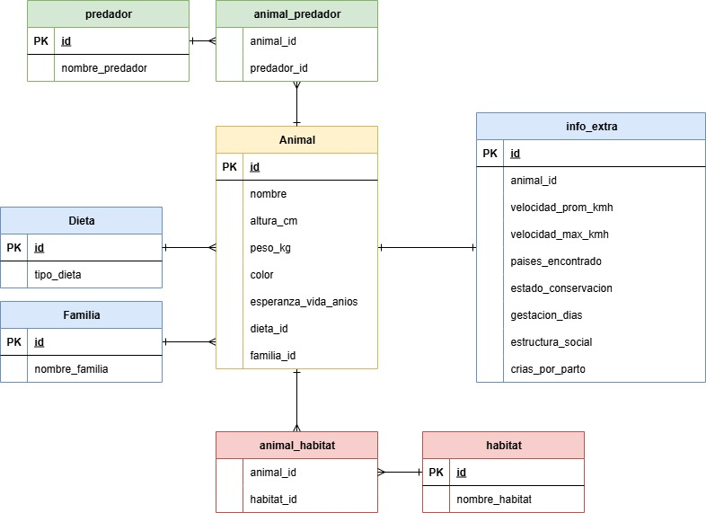

# IC4302 - Tarea Corta: Observability

**Curso:** Bases de Datos II (IC4302)  
**Semestre:** Segundo Semestre 2025  
**Institución:** Tecnológico de Costa Rica – Escuela de Ingeniería en Computación  


# Instrucciones de Ejecución
  
<details>
  <summary>Desplegar información</summary>  
  
### 4.1 Requisitos Previos
- Cuenta en Docker Hub
- Docker y Docker Compose  
- Kubernetes (Minikube o Docker Desktop)  
- Helm Charts instalados  
- Git
- Lens

### 4.2 Instalación de Componentes  


#### 1. Descargue el repositorio de la tarea corta en su computadora 
  
   ```bash
   git clone <URL_REPO>
   ```

Después ingrese a la carpeta del repositorio por medio de la terminal bash:  

   ```
cd 2025-02-IC4302
   ```
  
#### 2. Construya la imagenes de docker
Para poder realizar la construcción de las imágenes Docker. debe ingresar a la carpeta **docker** desde una terminal Bash y ejecutar el siguiente comando: 

 ```
./build.sh usuario 
 ```  
  
> NOTA: 
> Sustituya la palabra ususario con su usario de Docker Hub

#### 3. Configure el registro de  las imágenes para el chart
En su proyecto, ingrese a la carpeta de charts **-->** app **-->** templates **-->** values.yaml y reemplace el la imagen por su usuario correspondiente en docker hub, además reemplace el nombre de la imagen que desee probar segun las imagenes especificadas en la seccion *Imagenes Disponibles*:  
  
 ```
config:
  image: usuario/imagen

config:
  usuario/dataseeder
 ```

#### 3.2 Configure la carga y uso de las bases de datos

En caso de desear la ejecucion de solamente una base en especifico, ingrese a charts **-->** databases **-->** values.yaml en la cual usted podra modificar los campos enbale true = ejecutar base de datos, false = no ejecutar la base de datos.
```yaml
  elastic:
    enabled: false #Coloque segun su prefertencia
    version: 8.6.1
    replicas: 1 #minimo 3 datanodes
    name: ic4302
```
##### Configuracion de la carga de datos

Con la finalidad de evitar el llenado de bases de datos que no estan en ejecucion se establece un mecanismo similar al anterior en el cual dentro de charts **-->** app **-->** `values.yaml` podra colocar en `true` las bbases que se desear cargar. 

> [!IMPORTANT]  
> La duracion de construccion de la imagen dataseeder puede tardar unos minutos.

```yaml
    dataseeder: # Added configuration for DataSeeder
        enabled: true
        name: dataseeder
        replicas: 1
        image: darcecampos/dataseeder # To charge with data the database
        postgresEnable: true
        mariaDBEnable: false
        elasticSearchEnable: false
        vespaEnable: false
        chromaDBEnable: false
```

#### 4. Instale el Helm Chart del proyecto  

En su proyecto, ingrese a la carpeta de **charts** desde una terminal Bash y ejecute el siguiente comando:  
    
 ```
./install.sh
 ```

#### 5. Desinstalación del Helm Chart del proyecto

En caso de que usted necesite hacer la desinstalación del helm chart, ingrese a la carpeta de **charts** desde una terminal Bash y ejecute el siguiente comando:  
    
 ```
./uninstall.sh
 ```
> NOTA: 
> Si no necesita la instalación, ignore este paso

</details>

# Configuracion de las herramientas

# Maria DB

<details>
  <summary>Desplegar información</summary> 

Para Maria DB se utiliza la versión Open Source de MySQL. Esta configuración cumple con los requisitos solicitandos con:  
- **Alta disponibilidad** mediante un clúster con un *primary* y dos *replicas*.  
- **Persistencia de datos** con volúmenes de almacenamiento tanto para el nodo primario como para las replicas, estos con 8Gi de tamaño para el volumen.
Al realizar estas modificaciones aseguramos **escalabilidad** al incrementar las replicas que de igual manera puede aumentarse segun la carga de lectura.  También se asegura la **alta disponibilidad** en caso de que el nodo primario falle, una réplica puede mantener el servicio.

 ```yaml
  primary:
    persistence:
      enabled: true
      size: 8Gi
  secondary: #Minimo 2 replicas
    persistence:
      replicas: 2 
      enabled: true
      size: 8Gi
``` 
- El **Monitoreo** se realiza mediante la exposición de métricas de Prometheus habilitando la exportación de métricas desde Maria DB y la integración con el operador en Prometheus.  
 ```yaml
  metrics:
    enabled: true
    serviceMonitor:
      enabled: true
 ```


</details> 

# PostgreSQL

<details>
  <summary>Desplegar información</summary> 

Para la configuración de esta base de datos se habilita almacenamiento persistente para el nodo primario y un tamaño de 8Gi para el volumen de este.  También se habilita una unica replica con el mismo tamaño que el nodo primario.  
Al realizar estas modificaciones aseguramos **escalabilidad** al incrementar las replicas que de igual manera puede aumentarse segun la carga de lectura.  También se asegura la **alta disponibilidad** en caso de que el nodo primario falle, una réplica puede mantener el servicio.  
 ```yaml
primary:
    persistence:
      enabled: true
      size: 8Gi           
  readReplicas:
    replicaCount: 1
    persistence:
      enabled: true
      size: 8Gi

 ```

- El **Monitoreo** se realiza mediante la exposición de métricas de Prometheus habilitando la exportación de métricas desde PostgreSQL y la integración con el operador en Prometheus.  
 ```yaml
  metrics:
    enabled: true
    serviceMonitor:
      enabled: true
 ```

</details> 


# Elasticsearch

<details>
  <summary>Desplegar información</summary> 

Para la configuración de este clúster de Elasticsearch se estavblece un nodo máster encargado de la coordinación y gestión del clúster. Además, se configuró un conjunto de nodos de tipo data, con un mínimo de tres instancias las cuales son especificadas en el values.yaml, cada una con 2 Gi y 1 CPU asignados.    
Al realizar estas modificaciones aseguramos **escalabilidad** al incrementar las replicas que de igual manera puede aumentarse segun la carga de lectura.  También se asegura la **alta disponibilidad** en caso de que el nodo primario falle, una réplica puede mantener el servicio.  
 ```yaml
nodeSets:
  - name: master
    count: 1
    config:
      node.roles: ["master"]
        containers:
        - name: elasticsearch
          resources:
            requests:
              memory: 2Gi
              cpu: 1
            limits:
              memory: 2Gi

  - name: data
    count: {{ .Values.elastic.replicas }}
    config:
    podTemplate:
        containers:
        - name: elasticsearch
          resources:
            requests:
              memory: 2Gi
              cpu: 1
            limits:
              memory: 2Gi
 ```

 ```yaml
elastic:
  enabled: false
  version: 8.6.1
  replicas: 3 #minimo 3 datanodes
 ```

- El **Monitoreo** se realiza mediante la exposición de métricas de Prometheus habilitando la exportación de métricas desde elastic y la integración con el operador en Prometheus.  
 ```yaml
elasticsearch:
  metrics:
    enabled: false
    serviceMonitor:
      enabled: true
      namespace: "monitoring"
 ```

</details> 


# Redis y Memcached

<details>
  <summary>Desplegar información</summary> 

### Memcached
Para la realización de esta tarea se implementa Memcached, un sistema de caché en memoria distribuido, utilizado principalmente para acelerar el sistema al reducir la carga de la base de datos. Este también s eutiliza para exponer métricas de Memcached en formato Prometheus.
 ```yaml
  metrics:
    enabled: true
    serviceMonitor:
      enabled: true
 ```

Para la implementación de caché en todos los mos motores de bases de datos, se intenta recuperar el valor a partir de una clave, si este existe entonces sería un caché hit para que sea devuelto a la solicitud,  En caso de no encontrarse, se registra un caché miss y se procede a realizar la consulta directamente a la base de datos y posteriormente alamcena el resultado en Memcached.
</details> 


# Prometheus y Grafana

<details>
  <summary>Desplegar información</summary> 

  Con la finalidad de obtener las métricas específicas de las bases de datos, diferenciando entre el uso de cachés, ya sea memcached o redis, se crearon métricas personalizadas con labels que permite recolectar la información marcando estas diferencias. 
  ```
  peticiones_http = Counter('total_peticiones_http', 'Total peticiones HTTP', ['bd', 'cache'])
  promedio_tiempo = Histogram('promedio_tiempo_consulta', 'Tiempo promedio de consultas', ['bd', 'cache'])
  ```
  Estas métricas las scrapea el operador de prometheus por medio de un service y un service monitor, donde será guardado en el scraping de prometheus.
  Si queremos ver si se encuentra el endpoint en la interfaz de prometheus, podemos hacer port-forward al poner los siguientes comandos en bash:
  ```
    kubectl port-forward -n monitoring prometheus-monitoring-stack-prometheu-prometheus-0 9090:9090
  ```
  Y luego podemos acceder a la interfaz en la siguiente dirección en nuestro navegador:
  ```
    http://localhost:9090
  ```
  Una vez dentro de la interfaz de prometheus, ingresamos a -> status -> targets, y buscamos el target que diga "flasktest". Si el scraping se hizo correctamente, aparecerá en estado "up".


  Para ver los dashboards en grafana, primero debemos habilitar los dashboards que queremos ver en el proyecto en grafana.config -> values.yalm
  ```yalm
  dashboards:
    elasticsearch:
      name: elasticsearch
      file: elasticsearch.json
      enable: true
  ```
  Grafana está configurado para obtener como data source a prometheus. Para poder ver la interfaz de grafana, podemos hacer port-forward:
  ```
    kubectl port-forward pod/grafana-deployment-787b9688d8-dz29k 3000:3000 -n monitoring
  ```
  Y podemos acceder con las credenciales en:
  ```
    http://localhost:3000
  ```
  Credenciales: user -> admin, pass ->La encontraran en Secret -> grafana-admin-credentials -> GF_SECURITY_ADMIN_PASSWORD

  Una vez que ingresamos, buscamos la sección de dashboards. En la sección de dashboards ingresamos a "Monitoring", y ahí encontraremos el dashboard de la base de datos que queremos ver.

</details> 


# API Flask

<details>
  <summary>Desplegar información</summary>  


El presente componente representa los endpoints que permiten hacer pruebas de consultas a las diferentes bases de datos a las cuales se les aplica obsevabilidad.
## Documentación de Imágenes y Configuración en `values.yaml`

Este proyecto soporta diferentes imágenes de base de datos y variantes con Memcached o Redis como mecanismos de cache.  
El cambio de imagen se realiza modificando el archivo `values.yaml` en la sección correspondiente al despliegue de la API.

---

### Imágenes Disponibles

| Servicio       | Imagen Base         | Memcached           | Redis             |
|----------------|------------------|-------------------|-----------------|
| **ChromaDB**    | usuario/chroma     | usuario/chroma-memcached | usuario/chroma-redis |
| **Elasticsearch** | usuario/elasticsearch | usuario/elasticsearch-memcached | usuario/elasticsearch-redis |
| **MariaDB**     | usuario/mariadb    | usuario/mariadb-memcached | usuario/mariadb-redis |
| **PostgreSQL**  | usuario/postgresql | usuario/postgresql-memcached | usuario/postgresql-redis |
| **Vespa.ai**  | usuario/vespa | usuario/vespa-memcached | usuario/vespa-redis |


> **Nota:** Reemplace `usuario` por tu nombre de usuario en DockerHub (ejemplo: `mydockeruser/mariadb`).

---

## Configuración en `values.yaml`

En el archivo `values.yaml`, se define la imagen que utilizará el despliegue.  
La sección típica es la siguiente:

```yaml
config:
  flask:
    enabled: true
    name: flasktest
    replicas: 10
    image: usuario/imagen
```

### Ejemplo: Usar ChromaDB con Memcached
```yaml
config:
  flask:
    enabled: true
    name: flasktest
    replicas: 10
    image: usuario/chroma-memcached
```
---

# Dataset de Prueba: Información de Animales

Este apartado describe el dataset utilizado como prueba en el proyecto.  
El dataset proporciona información general sobre diversas especies animales, abarcando datos físicos, ecológicos, taxonómicos y de comportamiento.  

Fuente original: [Animal Information Dataset - Kaggle](https://www.kaggle.com/datasets/iamsouravbanerjee/animal-information-dataset)

---

## Descripción General

El dataset reúne un conjunto de características asociadas a distintos animales, como su altura, peso, dieta, hábitat, depredadores, estado de conservación, entre otros.  
Este recurso fue empleado como dataset de prueba para validar funcionalidades en el proyecto, ya que contiene datos variados que permiten realizar consultas, análisis y visualizaciones desde distintos enfoques.

---

## Estructura del Dataset

El dataset está compuesto por diversas columnas (atributos) que describen a cada animal. A continuación se detalla el glosario columna por columna:

| Columna                  | Descripción                                                                 |
|---------------------------|-----------------------------------------------------------------------------|
| **Animal**               | Nombre del animal.                                                          |
| **Height (cm)**          | Rango de altura en centímetros del animal.                                  |
| **Weight (kg)**          | Rango de peso en kilogramos del animal.                                     |
| **Color**                | Colores comunes asociados a la apariencia del animal.                       |
| **Lifespan (years)**     | Promedio de años de vida del animal.                                        |
| **Diet**                 | Tipo de dieta que sigue principalmente (Ejemplo: carnívoro, herbívoro).     |
| **Habitat**              | Hábitat o entorno natural donde suele encontrarse el animal.                 |
| **Predators**            | Depredadores o enemigos naturales del animal.                               |
| **Average Speed (km/h)** | Velocidad promedio en kilómetros por hora.                                  |
| **Countries Found**      | Países o regiones donde el animal es comúnmente encontrado.                 |
| **Conservation Status**  | Estado de conservación según organismos especializados (Ejemplo: En peligro).|
| **Family**               | Familia taxonómica a la que pertenece el animal.                            |
| **Gestation Period (days)** | Rango en días del período de gestación o embarazo.                      |
| **Top Speed (km/h)**     | Velocidad máxima alcanzable en kilómetros por hora.                         |
| **Social Structure**     | Estructura social o comportamiento (Ejemplo: solitario, en grupo).          |
| **Offspring per Birth**  | Número típico de crías por evento reproductivo.                             |

---
 
# Esquema Relacional del Dataset de Animales - MariaDB

Este apartado describe la estructura de base de datos SQL diseñada para almacenar el dataset de prueba sobre animales.  
La implementación sigue un modelo relacional normalizado, con separación de entidades principales y relaciones uno a muchos y muchos a muchos.

---



---

### Mapeo de las bases documentales 
 ```json
{
  "animals": {
    "mappings": {
      "properties": {
        "average_speed_kmh": {
          "type": "keyword"
        },
        "color": {
          "type": "keyword"
        },
        "conservation_status": {
          "type": "keyword"
        },
        "countries_found": {
          "type": "text"
        },
        "diet": {
          "type": "keyword"
        },
        "family": {
          "type": "keyword"
        },
        "gestation_period_days": {
          "type": "keyword"
        },
        "habitat": {
          "type": "text"
        },
        "height_cm": {
          "type": "keyword"
        },
        "lifespan_years": {
          "type": "keyword"
        },
        "name": {
          "type": "keyword"
        },
        "offspring_per_birth": {
          "type": "keyword"
        },
        "predators": {
          "type": "text"
        },
        "social_structure": {
          "type": "text"
        },
        "top_speed_kmh": {
          "type": "keyword"
        },
        "weight_kg": {
          "type": "keyword"
        }
      }
    }
  }
 ```

# Endpoints de prueba 
Base URL: http://localhost:30080/

Esta API permite consultar información sobre animales y sus características.

---

## Endpoints

### 1. Health Check

**GET** /health

Verifica que el servicio está activo y funcionando.

**Request:**
GET http://localhost:30080/health

**Response:**
{
  "status": "healthy"
}

Código de estado: 200 OK

---

### 2. Listar Animales

**GET** /animales

Devuelve los primeros 50 animales registrados en la base de datos.

**Request:**
GET http://localhost:30080/animales

**Response exitoso (200 OK):**
[
  {"id": 1, "nombre": "Tigre"},
  {"id": 2, "nombre": "León"},
  ...
]

**Response de error (500 Internal Server Error):**
{
  "error": "No se pudo conectar a la base de datos"
}

Notas:
- Utiliza un pool de conexiones a PostgreSQL.
- Se asegura de cerrar el cursor y devolver la conexión al pool.

---

### 3. Animales listados por su color

**GET** /colores

Devuelve los animales organizados por sus colores.

**Request:**
GET http://localhost:30080/colores

**Response exitoso (200 OK):**
[
   {
        "animals": "Uakari",
        "color": "Bald, Red"
   }
]

**Response de error (500 Internal Server Error):**
{
  "error": "No se pudo conectar a la base de datos"
}

---

## Resumen de Endpoints

| Endpoint         | Método | Descripción                                | Response Ejemplo                      | Código Estado |
|-----------------|--------|--------------------------------------------|--------------------------------------|---------------|
| /health         | GET    | Verifica que el servicio está activo       | {"status": "healthy"}              | 200           |
| /animales       | GET    | Lista los primeros 50 animales             | [{"id":1,"nombre":"Tigre"},...]  | 200 / 500     |
| /colores        | GET    | Lista los colores y los animales           | [{"animals":"Guepardo","color":"grey"},...] | 200 / 500 |

## Llenado de las bases de datos a utilizar
Con la finalidad de generar el llenado de las bases de datos, el software ofrece un componente de tipo job, el cual representa el dataseeder, basado en la imagen que llenas las bases de datos. Este proceso se ejecuta al instante de realizar la instalacion.


</details>


---
# Pruebas de cargas

<details>
  <summary>Desplegar información</summary> 

Se implementan pruebas de carga mediante la herramienta de código abierto Gatling. La misma se se integra en la tarea mediante plugins compilados por Maven, definidos en el archivo "pom.xml". 

Pasos para correr las pruebas de carga:

1. Si no tiene en su equipo Maven, instalarlo y añadirlo a variables de entorno, se puede seguir el siguiente ejemplo: https://www.youtube.com/watch?v=rl5-yyrmp-0
   
2. Gatling corre el archivo src/test/java/simulations/GatlingTest.Java; al principio del archivo se pueden encontrar las siguientes variables:
   
   int users = 100;
   
   int time = 900;

   Estas se pueden modificar con la cantidad de usuarios con los que se desea hacer la carga y la duración de la prueba en segundos que se desea.
   
4. En la terminal bash acceder a la carpeta TC1 dentro del repositorio:
      ```
      cd 2025-02-IC4302/TC1
      ```
5. Correr el comando "mvn gatling:test", esto ejecuta las pruebas y da actualizaciones en vivo en la terminal.
6. Al finalizar la prueba, se guarda el resultado en target/gatling/<nombre de la prueba y fecha/index.html
   Se puede abrir en internet y ver los datos de la prueba de carga. 

---

## Pruebas de cargar realizadas
En el presente apartado se desarrollan los tests realizados por cada motor de bases de datos.

### Configuracion del entorno de pruebas
#### Motores de bases de datos evaluados
- MariaDB
- PostgreSQL
- Elasticsearch
- ChromaDB
- Vespa.ia

#### Configuraciones de Cache por motor
- Sin caché
- Con Redis
- Con Memcached

#### Endpoints Evaluados
- GET /animales
- GET /colores

### Pruebas por Motor de Base de Datos

<details>
  <summary>Maria DB</summary> 

#### MariaDB
##### Prueba 1: MariaDB Sin Caché 

###### Configuración

- **Nombre del escenario:** Random Calls
- **Usuarios:** 500
- **Duración total:** 900 segundos (15 minutos)
- **Tipo de inyección:** `rampUsersDuring`
- **Repeticiones por usuario:** 5

## Endpoints utilizados
- `/animales`
- `/colores`

## Request
- **Nombre:** Random Query
- **Método:** GET
- **Endpoint dinámico:** `#{endpoint}` (seleccionado aleatoriamente)
- **Check:** Status HTTP 200


###### Resultados
```cmd
================================================================================
---- Global Information --------------------------------------------------------
> request count                                        505 (OK=5      KO=500   )
> min response time                                      4 (OK=356    KO=4     )
> max response time                                  21449 (OK=379    KO=21449 )
> mean response time                                   562 (OK=362    KO=564   )
> std deviation                                       1058 (OK=9      KO=1063  )
> response time 50th percentile                        357 (OK=358    KO=152   )
> response time 75th percentile                       1031 (OK=359    KO=1031  )
> response time 95th percentile                       1044 (OK=375    KO=1044  )
> response time 99th percentile                       1081 (OK=378    KO=1081  )
> mean requests/sec                                  0.562 (OK=0.006  KO=0.556 )
---- Response Time Distribution ------------------------------------------------
> t < 800 ms                                             5 (  1%)
> 800 ms <= t < 1200 ms                                  0 (  0%)
> t >= 1200 ms                                           0 (  0%)
> failed                                               500 ( 99%)
---- Errors --------------------------------------------------------------------
> j.i.IOException: Premature close                                  500 (100.0%)
================================================================================
```


###### Conclusiones
Podemos ver que al probar con la base de datos sin caché, hay distintas características que se pueden notar en el gráfico. Primero, se ve que el número de peticiones experimenta una subida lineal, conforme van llegando más peticiones de gatling. También se puede notar que la latencia es variable. Claramente, no hay datos de la caché. Es muy interesante ver como va variando el workload una vez que inician y terminan las consultas. Por ejemplo, el disco tiende a mantenerse estable, mientras que la CPU y la conexión a red no son estables, y tienen picos cuando aumentan o disminuyen las peticiones.


##### Prueba 2: MariaDB Con Redis

###### Configuración

- **Nombre del escenario:** Random Calls
- **Usuarios:** 500
- **Duración total:** 900 segundos (15 minutos)
- **Tipo de inyección:** `rampUsersDuring`
- **Repeticiones por usuario:** 5

## Endpoints utilizados
- `/animales`
- `/colores`

## Request
- **Nombre:** Random Query
- **Método:** GET
- **Endpoint dinámico:** `#{endpoint}` (seleccionado aleatoriamente)
- **Check:** Status HTTP 200

###### Resultados
```cmd
================================================================================
---- Global Information --------------------------------------------------------
> request count                                        505 (OK=5      KO=500   )
> min response time                                     48 (OK=48     KO=2007  )
> max response time                                   6095 (OK=74     KO=6095  )
> mean response time                                  2768 (OK=60     KO=2795  )
> std deviation                                        792 (OK=11     KO=748   )
> response time 50th percentile                       3024 (OK=61     KO=3025  )
> response time 75th percentile                       3043 (OK=71     KO=3043  )
> response time 95th percentile                       4064 (OK=73     KO=4064  )
> response time 99th percentile                       5075 (OK=74     KO=5075  )
> mean requests/sec                                   0.56 (OK=0.006  KO=0.555 )
---- Response Time Distribution ------------------------------------------------
> t < 800 ms                                             5 (  1%)
> 800 ms <= t < 1200 ms                                  0 (  0%)
> t >= 1200 ms                                           0 (  0%)
> failed                                               500 ( 99%)
---- Errors --------------------------------------------------------------------
> j.i.IOException: Premature close                                  500 (100.0%)
================================================================================

```


###### Conclusiones
En el caso de redis, podemos ver la subida de actividad, y luego una disminución. Durante la actividad, hubo mucho movimiento e CPU, memoria y tráfico de red, pero no tanto de disco. Podemos concluir que el disco no es muy usado durante estas pruebas, y que dependen más de CPU y memoria. Es decir, que será más rápido que acceder al disco.


##### Prueba 3: MariaDB Con Memcached

###### Configuración

- **Nombre del escenario:** Random Calls
- **Usuarios:** 500
- **Duración total:** 900 segundos (15 minutos)
- **Tipo de inyección:** `rampUsersDuring`
- **Repeticiones por usuario:** 5

## Endpoints utilizados
- `/animales`
- `/colores`

## Request
- **Nombre:** Random Query
- **Método:** GET
- **Endpoint dinámico:** `#{endpoint}` (seleccionado aleatoriamente)
- **Check:** Status HTTP 200

###### Resultados
```cmd
================================================================================
---- Global Information --------------------------------------------------------
> request count                                        505 (OK=5      KO=500   )
> min response time                                      4 (OK=356    KO=4     )
> max response time                                  21449 (OK=379    KO=21449 )
> mean response time                                   562 (OK=362    KO=564   )
> std deviation                                       1058 (OK=9      KO=1063  )
> response time 50th percentile                        357 (OK=358    KO=152   )
> response time 75th percentile                       1031 (OK=359    KO=1031  )
> response time 95th percentile                       1044 (OK=375    KO=1044  )
> response time 99th percentile                       1081 (OK=378    KO=1081  )
> mean requests/sec                                  0.562 (OK=0.006  KO=0.556 )
---- Response Time Distribution ------------------------------------------------
> t < 800 ms                                             5 (  1%)
> 800 ms <= t < 1200 ms                                  0 (  0%)
> t >= 1200 ms                                           0 (  0%)
> failed                                               500 ( 99%)
---- Errors --------------------------------------------------------------------
> j.i.IOException: Premature close                                  500 (100.0%)
================================================================================
```


###### Conclusiones
En el caso de Memcached, podemos ver que es curioso que hay picos mucho más grandes de latencia, pero la mayor parte del tiempo la latencia es baja. Esto se debe a que se ahorra tiempo cada vez que hay caché hit, pero a cambio pierde mucho tiempo cuando hay un caché miss. Podemos notar que hay mucho más uso de CPU, memoria, y tráfico de red. Mientras que el disco, siempre se mantiene estable. También podemos una diferencia en los file descriptors, que es ligeramente mayor.


##### Prueba 4: MariaDB Con Redis

Este escenario simula llamadas aleatorias a los endpoints `/animales` y `/colores`.  
Cada usuario realiza **2 peticiones**, seleccionando de manera aleatoria uno de los endpoints en cada iteración.  
Se incluye una inyección de usuarios diseñado para probar picos y cargas constantes del sistema.

###### Configuración

- **Nombre del escenario:** Random Calls
- **Repeticiones por usuario:** 2
- **Endpoints utilizados:** `/animales`, `/colores`
- **Request:**
  - **Nombre:** Random Query
  - **Método:** GET
  - **Endpoint dinámico:** `#{endpoint}` (seleccionado aleatoriamente)
  - **Check:** Status HTTP 200

### Random Calls
- **Espera inicial:** 10 segundos (`nothingFor`)
- **Subida gradual:** 2 usuarios durante 2 minutos (`rampUsers`)
- **Pico de usuarios:** 3 usuarios durante 1 minuto (`rampUsers`)
- **Carga constante:** 1 usuario por segundo durante 12 minutos (`constantUsersPerSec`)

###### Resultados
```cmd
================================================================================
---- Global Information --------------------------------------------------------
> request count                                        505 (OK=5      KO=500   )
> min response time                                     46 (OK=46     KO=2009  )
> max response time                                  16081 (OK=56     KO=16081 )
> mean response time                                  2702 (OK=50     KO=2729  )
> std deviation                                       1176 (OK=4      KO=1151  )
> response time 50th percentile                       3024 (OK=50     KO=3025  )
> response time 75th percentile                       3042 (OK=53     KO=3042  )
> response time 95th percentile                       3080 (OK=55     KO=3080  )
> response time 99th percentile                       3188 (OK=56     KO=3197  )
> mean requests/sec                                   0.56 (OK=0.006  KO=0.555 )
---- Response Time Distribution ------------------------------------------------
> t < 800 ms                                             5 (  1%)
> 800 ms <= t < 1200 ms                                  0 (  0%)
> t >= 1200 ms                                           0 (  0%)
> failed                                               500 ( 99%)
---- Errors --------------------------------------------------------------------
> j.i.IOException: Premature close                                  500 (100.0%)
================================================================================
```


##### Conclusiones

Se puede ver, en este caso, donde hay claros picos de actividad y latencia, que son regulares debido a la naturaleza de la prueba. Hay una gran cantidad de cache miss, e incluso hay un salto en el uso de disco, que usualmente se mantiene es estable. El uso de CPU y de memoria fue significativo, y también se notaron saltos de red.


##### Prueba 5: MariaDB Con Memcached

Este escenario simula llamadas aleatorias a los endpoints `/animales` y `/colores`.  
Cada usuario realiza **2 peticiones**, seleccionando de manera aleatoria uno de los endpoints en cada iteración.  
Se incluye una inyección de usuarios diseñado para probar picos y cargas constantes del sistema.

###### Configuración

- **Nombre del escenario:** Random Calls
- **Repeticiones por usuario:** 2
- **Endpoints utilizados:** `/animales`, `/colores`
- **Request:**
  - **Nombre:** Random Query
  - **Método:** GET
  - **Endpoint dinámico:** `#{endpoint}` (seleccionado aleatoriamente)
  - **Check:** Status HTTP 200

### Random Calls
- **Espera inicial:** 10 segundos (`nothingFor`)
- **Subida gradual:** 2 usuarios durante 2 minutos (`rampUsers`)
- **Pico de usuarios:** 3 usuarios durante 1 minuto (`rampUsers`)
- **Carga constante:** 1 usuario por segundo durante 12 minutos (`constantUsersPerSec`)

###### Resultados
```cmd
================================================================================
---- Global Information --------------------------------------------------------
> request count                                        505 (OK=5      KO=500   )
> min response time                                      4 (OK=32     KO=4     )
> max response time                                   1084 (OK=42     KO=1084  )
> mean response time                                   588 (OK=38     KO=593   )
> std deviation                                        503 (OK=4      KO=502   )
> response time 50th percentile                       1014 (OK=40     KO=1014  )
> response time 75th percentile                       1029 (OK=41     KO=1029  )
> response time 95th percentile                       1042 (OK=42     KO=1042  )
> response time 99th percentile                       1055 (OK=42     KO=1055  )
> mean requests/sec                                  0.562 (OK=0.006  KO=0.556 )
---- Response Time Distribution ------------------------------------------------
> t < 800 ms                                             5 (  1%)
> 800 ms <= t < 1200 ms                                  0 (  0%)
> t >= 1200 ms                                           0 (  0%)
> failed                                               500 ( 99%)
---- Errors --------------------------------------------------------------------
> j.i.IOException: Premature close                                  500 (100.0%)
================================================================================
```


##### Conclusiones
En este caso se ven muy claros picos de latencia, CPU, y memoria. Esto se debe a que la prueba fue programada con picos de actividad, claramente reflejados en los gráficos. El disco, como es lo usual, no fue muy utilizado y se mantuvo estable. Los file descriptor e IOPS también se mantuvieron estables, al igual que las conexiones abiertas.

</details> 

<details>
  <summary>Elasticsearch</summary> 

#### Elasticsearch
## Prueba 1: Elasticsearch Sin Caché 
Este escenario simula llamadas aleatorias a los endpoints `/animales` y `/colores`.  
Cada usuario realiza **5 peticiones** seleccionando de manera aleatoria uno de los endpoints en cada iteración.

###### Configuración

- **Nombre del escenario:** Random Calls
- **Usuarios:** 100
- **Duración total:** 900 segundos (15 minutos)
- **Tipo de inyección:** `rampUsersDuring`
- **Repeticiones por usuario:** 5

## Endpoints utilizados
- `/animales`
- `/colores`

## Request
- **Nombre:** Random Query
- **Método:** GET
- **Endpoint dinámico:** `#{endpoint}` (seleccionado aleatoriamente)
- **Check:** Status HTTP 200


###### Resultados
```cmd
================================================================================
---- Global Information --------------------------------------------------------
> request count                                        505 (OK=505    KO=0     )
> min response time                                      8 (OK=8      KO=-     )
> max response time                                   3116 (OK=3116   KO=-     )
> mean response time                                   180 (OK=180    KO=-     )
> std deviation                                        467 (OK=467    KO=-     )
> response time 50th percentile                         22 (OK=22     KO=-     )
> response time 75th percentile                         45 (OK=45     KO=-     )
> response time 95th percentile                       1295 (OK=1295   KO=-     )
> response time 99th percentile                       2426 (OK=2426   KO=-     )
> mean requests/sec                                  0.567 (OK=0.567  KO=-     )
---- Response Time Distribution ------------------------------------------------
> t < 800 ms                                           462 ( 91%)
> 800 ms <= t < 1200 ms                                 16 (  3%)
> t >= 1200 ms                                          27 (  5%)
> failed                                                 0 (  0%)
================================================================================
```


###### Conclusiones
Cuando probamos el sistema con 100 usuarios consultando /animales y /colores sin caché, todas las peticiones fueron exitosas, lo cual es muy bueno. La mayoría de las respuestas fueron rápidas (menos de 800 ms), pero algunas tardaron más (hasta 2426 ms). Esto nos enseña que el sistema funciona bien en la mayoría de los casos, pero que ciertas consultas pueden ser más lentas. Como aprendizaje, podemos pensar en usar caché para hacer que todas las respuestas sean más rápidas y consistentes.

## Prueba 2: Elasticsearch Con Redis 

###### Configuración

- **Nombre del escenario:** Random Calls
- **Usuarios:** 100
- **Duración total:** 900 segundos (15 minutos)
- **Tipo de inyección:** `rampUsersDuring`
- **Repeticiones por usuario:** 5

## Endpoints utilizados
- `/animales`
- `/colores`

## Request
- **Nombre:** Random Query
- **Método:** GET
- **Endpoint dinámico:** `#{endpoint}` (seleccionado aleatoriamente)
- **Check:** Status HTTP 200

###### Resultados
```cmd
================================================================================
---- Global Information --------------------------------------------------------
> request count                                        505 (OK=505    KO=0     )
> min response time                                    307 (OK=307    KO=-     )
> max response time                                  12844 (OK=12844  KO=-     )
> mean response time                                  8117 (OK=8117   KO=-     )
> std deviation                                        867 (OK=867    KO=-     )
> response time 50th percentile                       8085 (OK=8085   KO=-     )
> response time 75th percentile                       8167 (OK=8167   KO=-     )
> response time 95th percentile                       8606 (OK=8606   KO=-     )
> response time 99th percentile                       9941 (OK=9941   KO=-     )
> mean requests/sec                                  0.542 (OK=0.542  KO=-     )
---- Response Time Distribution ------------------------------------------------
> t < 800 ms                                             5 (  1%)
> 800 ms <= t < 1200 ms                                  0 (  0%)
> t >= 1200 ms                                         500 ( 99%)
> failed                                                 0 (  0%)
================================================================================
```


###### Conclusiones
Al probar Redis, todas las peticiones también fueron exitosas, pero los tiempos de respuesta fueron más largos de lo esperado. Esto nos muestra que, aunque Redis está presente, necesitamos revisar cómo estamos usando el caché, cómo se generan las claves y cómo se consultan. Es un aprendizaje valioso: no basta con tener un caché, hay que configurarlo y usarlo correctamente para aprovecharlo.


## Prueba 3: Elasticsearch Con Memcached

###### Configuración

- **Nombre del escenario:** Random Calls
- **Usuarios:** 100
- **Duración total:** 900 segundos (15 minutos)
- **Tipo de inyección:** `rampUsersDuring`
- **Repeticiones por usuario:** 5

## Endpoints utilizados
- `/animales`
- `/colores`

## Request
- **Nombre:** Random Query
- **Método:** GET
- **Endpoint dinámico:** `#{endpoint}` (seleccionado aleatoriamente)
- **Check:** Status HTTP 200

###### Resultados
```cmd
================================================================================
---- Global Information --------------------------------------------------------
> request count                                        505 (OK=504    KO=1     )
> min response time                                      3 (OK=3      KO=60009 )
> max response time                                  60009 (OK=6013   KO=60009 )
> mean response time                                   355 (OK=237    KO=60009 )
> std deviation                                       2772 (OK=789    KO=0     )
> response time 50th percentile                          9 (OK=9      KO=60009 )
> response time 75th percentile                         51 (OK=50     KO=60009 )
> response time 95th percentile                       1436 (OK=1377   KO=60009 )
> response time 99th percentile                       4961 (OK=4950   KO=60009 )
> mean requests/sec                                  0.504 (OK=0.503  KO=0.001 )
---- Response Time Distribution ------------------------------------------------
> t < 800 ms                                           465 ( 92%)
> 800 ms <= t < 1200 ms                                 11 (  2%)
> t >= 1200 ms                                          28 (  6%)
> failed                                                 1 (  0%)
---- Errors --------------------------------------------------------------------
> Request timeout to localhost/127.0.0.1:30080 after 60000 ms         1 (100.0%)
================================================================================
```


##### Conclusiones

Con Memcached, las respuestas fueron mucho más rápidas: la mayoría se resolvió en menos de 800 ms y la mediana fue de solo 9 ms. Esto nos enseña que un caché bien configurado puede acelerar significativamente las consultas. Hubo un pequeño fallo por timeout, lo que nos recuerda que siempre es bueno monitorear la red y la saturación, pero en general la prueba fue muy positiva.

## Prueba 4: Elasticsearch Con Redis
Este escenario simula llamadas aleatorias a los endpoints `/animales` y `/colores`.  
Cada usuario realiza **2 peticiones**, seleccionando de manera aleatoria uno de los endpoints en cada iteración.  
Se incluye una inyección de usuarios diseñado para probar picos y cargas constantes del sistema.

###### Configuración

- **Nombre del escenario:** Random Calls
- **Repeticiones por usuario:** 2
- **Endpoints utilizados:** `/animales`, `/colores`
- **Request:**
  - **Nombre:** Random Query
  - **Método:** GET
  - **Endpoint dinámico:** `#{endpoint}` (seleccionado aleatoriamente)
  - **Check:** Status HTTP 200

### Random Calls
- **Espera inicial:** 10 segundos (`nothingFor`)
- **Subida gradual:** 2 usuarios durante 2 minutos (`rampUsers`)
- **Pico de usuarios:** 3 usuarios durante 1 minuto (`rampUsers`)
- **Carga constante:** 1 usuario por segundo durante 12 minutos (`constantUsersPerSec`)

###### Resultados
```cmd
================================================================================
---- Global Information --------------------------------------------------------
> request count                                       1455 (OK=1455   KO=0     )
> min response time                                    202 (OK=202    KO=-     )
> max response time                                  15666 (OK=15666  KO=-     )
> mean response time                                  8171 (OK=8171   KO=-     )
> std deviation                                        660 (OK=660    KO=-     )
> response time 50th percentile                       8091 (OK=8091   KO=-     )
> response time 75th percentile                       8169 (OK=8169   KO=-     )
> response time 95th percentile                       8527 (OK=8527   KO=-     )
> response time 99th percentile                      10380 (OK=10380  KO=-     )
> mean requests/sec                                  1.573 (OK=1.573  KO=-     )
---- Response Time Distribution ------------------------------------------------
> t < 800 ms                                             5 (  0%)
> 800 ms <= t < 1200 ms                                  0 (  0%)
> t >= 1200 ms                                        1450 (100%)
> failed                                                 0 (  0%)
================================================================================
```


##### Conclusiones
En otra prueba con Redis, vimos que los tiempos de respuesta seguían siendo largos, aunque todas las peticiones fueron exitosas. Esto nos da un aprendizaje importante: debemos revisar la lógica de caché y cómo Redis maneja las consultas, y compararlo con otras opciones como Memcached, que en pruebas anteriores mostró mejor rendimiento. Lo bueno es que el sistema sigue funcionando correctamente y podemos aprender a optimizarlo.

## Prueba 5: Elasticsearch Con Memcached

###### Configuración

- **Nombre del escenario:** Random Calls
- **Repeticiones por usuario:** 2
- **Endpoints utilizados:** `/animales`, `/colores`
- **Request:**
  - **Nombre:** Random Query
  - **Método:** GET
  - **Endpoint dinámico:** `#{endpoint}` (seleccionado aleatoriamente)
  - **Check:** Status HTTP 200

### Random Calls
- **Espera inicial:** 10 segundos (`nothingFor`)
- **Subida gradual:** 2 usuarios durante 2 minutos (`rampUsers`)
- **Pico de usuarios:** 3 usuarios durante 1 minuto (`rampUsers`)
- **Carga constante:** 1 usuario por segundo durante 12 minutos (`constantUsersPerSec`)
  
###### Resultados
```cmd
================================================================================
---- Global Information --------------------------------------------------------
> request count                                       1455 (OK=1455   KO=0     )
> min response time                                      3 (OK=3      KO=-     )
> max response time                                    934 (OK=934    KO=-     )
> mean response time                                    24 (OK=24     KO=-     )
> std deviation                                         74 (OK=74     KO=-     )
> response time 50th percentile                         10 (OK=10     KO=-     )
> response time 75th percentile                         15 (OK=15     KO=-     )
> response time 95th percentile                         54 (OK=54     KO=-     )
> response time 99th percentile                        439 (OK=439    KO=-     )
> mean requests/sec                                  1.601 (OK=1.601  KO=-     )
---- Response Time Distribution ------------------------------------------------
> t < 800 ms                                          1452 (100%)
> 800 ms <= t < 1200 ms                                  3 (  0%)
> t >= 1200 ms                                           0 (  0%)
> failed                                                 0 (  0%)
================================================================================
```


##### Conclusiones
Cuando probamos Memcached con muchas peticiones, todas fueron exitosas y rápidas (menos de 800 ms), con una mediana de 10 ms. Esto nos demuestra que un buen sistema de caché puede hacer que el usuario tenga una experiencia rápida y estable, incluso con mucha carga. Además, la estabilidad y la baja variabilidad nos enseñan que la implementación de Memcached es confiable y muy útil para entornos con muchos usuarios.

</details> 

<details>
  <summary>PostgreSQL</summary> 

#### PostgreSQL
##### Prueba 1: PostgreSQL Sin Caché 

###### Configuración
- **Nombre del escenario:** Random Calls
- **Usuarios:** 500
- **Duración total:** 900 segundos (15 minutos)
- **Tipo de inyección:** `rampUsersDuring`
- **Repeticiones por usuario:** 5

## Endpoints utilizados
- `/animales`
- `/colores`

## Request
- **Nombre:** Random Query
- **Método:** GET
- **Endpoint dinámico:** `#{endpoint}` (seleccionado aleatoriamente)
- **Check:** Status HTTP 200


###### Resultados

##### Conclusiones

##### Prueba 2: PostgreSQL Con Redis

###### Configuración
- **Nombre del escenario:** Random Calls
- **Usuarios:** 500
- **Duración total:** 900 segundos (15 minutos)
- **Tipo de inyección:** `rampUsersDuring`
- **Repeticiones por usuario:** 5

## Endpoints utilizados
- `/animales`
- `/colores`

## Request
- **Nombre:** Random Query
- **Método:** GET
- **Endpoint dinámico:** `#{endpoint}` (seleccionado aleatoriamente)
- **Check:** Status HTTP 200

###### Resultados

##### Conclusiones

##### Prueba 3: PostgreSQL Con Memcached 

###### Configuración
- **Nombre del escenario:** Random Calls
- **Usuarios:** 500
- **Duración total:** 900 segundos (15 minutos)
- **Tipo de inyección:** `rampUsersDuring`
- **Repeticiones por usuario:** 5

## Endpoints utilizados
- `/animales`
- `/colores`

## Request
- **Nombre:** Random Query
- **Método:** GET
- **Endpoint dinámico:** `#{endpoint}` (seleccionado aleatoriamente)
- **Check:** Status HTTP 200

###### Resultados

##### Conclusiones

##### Prueba 4: PostgreSQL Con Redis 

Este escenario simula llamadas aleatorias a los endpoints `/animales` y `/colores`.  
Cada usuario realiza **2 peticiones**, seleccionando de manera aleatoria uno de los endpoints en cada iteración.  
Se incluye una inyección de usuarios diseñado para probar picos y cargas constantes del sistema.

###### Configuración

- **Nombre del escenario:** Random Calls
- **Repeticiones por usuario:** 2
- **Endpoints utilizados:** `/animales`, `/colores`
- **Request:**
  - **Nombre:** Random Query
  - **Método:** GET
  - **Endpoint dinámico:** `#{endpoint}` (seleccionado aleatoriamente)
  - **Check:** Status HTTP 200

### Random Calls
- **Espera inicial:** 10 segundos (`nothingFor`)
- **Subida gradual:** 2 usuarios durante 2 minutos (`rampUsers`)
- **Pico de usuarios:** 3 usuarios durante 1 minuto (`rampUsers`)
- **Carga constante:** 1 usuario por segundo durante 12 minutos (`constantUsersPerSec`)

###### Resultados

##### Conclusiones

##### Prueba 5: PostgreSQL Con Memcached 

Este escenario simula llamadas aleatorias a los endpoints `/animales` y `/colores`.  
Cada usuario realiza **2 peticiones**, seleccionando de manera aleatoria uno de los endpoints en cada iteración.  
Se incluye una inyección de usuarios diseñado para probar picos y cargas constantes del sistema.

###### Configuración

- **Nombre del escenario:** Random Calls
- **Repeticiones por usuario:** 2
- **Endpoints utilizados:** `/animales`, `/colores`
- **Request:**
  - **Nombre:** Random Query
  - **Método:** GET
  - **Endpoint dinámico:** `#{endpoint}` (seleccionado aleatoriamente)
  - **Check:** Status HTTP 200

### Random Calls
- **Espera inicial:** 10 segundos (`nothingFor`)
- **Subida gradual:** 2 usuarios durante 2 minutos (`rampUsers`)
- **Pico de usuarios:** 3 usuarios durante 1 minuto (`rampUsers`)
- **Carga constante:** 1 usuario por segundo durante 12 minutos (`constantUsersPerSec`)

###### Resultados

##### Conclusiones

</details> 

<details>
  <summary>ChromaDB</summary> 


#### Chroma
## Prueba 1: Chroma Sin Caché 
Este escenario simula llamadas aleatorias a los endpoints `/animales` y `/colores`.  
Cada usuario realiza **5 peticiones** seleccionando de manera aleatoria uno de los endpoints en cada iteración.

###### Configuración

- **Nombre del escenario:** Random Calls
- **Usuarios:** 100
- **Duración total:** 900 segundos (15 minutos)
- **Tipo de inyección:** `rampUsersDuring`
- **Repeticiones por usuario:** 5

## Endpoints utilizados
- `/animales`
- `/colores`

## Request
- **Nombre:** Random Query
- **Método:** GET
- **Endpoint dinámico:** `#{endpoint}` (seleccionado aleatoriamente)
- **Check:** Status HTTP 200


###### Resultados
```cmd
================================================================================
---- Global Information --------------------------------------------------------
> request count                                        505 (OK=505    KO=0     )
> min response time                                      8 (OK=8      KO=-     )
> max response time                                    567 (OK=567    KO=-     )
> mean response time                                    20 (OK=20     KO=-     )
> std deviation                                         35 (OK=35     KO=-     )
> response time 50th percentile                         13 (OK=13     KO=-     )
> response time 75th percentile                         19 (OK=19     KO=-     )
> response time 95th percentile                         36 (OK=36     KO=-     )
> response time 99th percentile                        147 (OK=147    KO=-     )
> mean requests/sec                                  0.562 (OK=0.562  KO=-     )
---- Response Time Distribution ------------------------------------------------
> t < 800 ms                                           505 (100%)
> 800 ms <= t < 1200 ms                                  0 (  0%)
> t >= 1200 ms                                           0 (  0%)
> failed                                                 0 (  0%)
================================================================================
```


###### Conclusiones

Cuando hacemos el test con 100 usuarios consultando aleatoriamente a los endopints disponibles, se puede observar peticiones exitosas esto demuestra un buen rendimiento a la hora de realizarlos. Vemos que las respuestas fueron considerablemente rápidas.  100 usuarios es un número significativo y podemos observar que chroma soporta bajo carga de una manera bastante buena incluso cuando no se implementa ningún tipo de caché  

## Prueba 2: Chroma Con Redis 

###### Configuración

- **Nombre del escenario:** Random Calls
- **Usuarios:** 100
- **Duración total:** 900 segundos (15 minutos)
- **Tipo de inyección:** `rampUsersDuring`
- **Repeticiones por usuario:** 5

## Endpoints utilizados
- `/animales`
- `/colores`

## Request
- **Nombre:** Random Query
- **Método:** GET
- **Endpoint dinámico:** `#{endpoint}` (seleccionado aleatoriamente)
- **Check:** Status HTTP 200

###### Resultados
```cmd
```


###### Conclusiones


## Prueba 3: Chroma Con Memcached

###### Configuración

- **Nombre del escenario:** Random Calls
- **Usuarios:** 100
- **Duración total:** 900 segundos (15 minutos)
- **Tipo de inyección:** `rampUsersDuring`
- **Repeticiones por usuario:** 5

## Endpoints utilizados
- `/animales`
- `/colores`

## Request
- **Nombre:** Random Query
- **Método:** GET
- **Endpoint dinámico:** `#{endpoint}` (seleccionado aleatoriamente)
- **Check:** Status HTTP 200

###### Resultados
```cmd
```

##### Conclusiones


## Prueba 4: Chroma Con Redis
Este escenario simula llamadas aleatorias a los endpoints `/animales` y `/colores`.  
Cada usuario realiza **2 peticiones**, seleccionando de manera aleatoria uno de los endpoints en cada iteración.  
Se incluye una inyección de usuarios diseñado para probar picos y cargas constantes del sistema.

###### Configuración

- **Nombre del escenario:** Random Calls
- **Repeticiones por usuario:** 2
- **Endpoints utilizados:** `/animales`, `/colores`
- **Request:**
  - **Nombre:** Random Query
  - **Método:** GET
  - **Endpoint dinámico:** `#{endpoint}` (seleccionado aleatoriamente)
  - **Check:** Status HTTP 200

### Random Calls
- **Espera inicial:** 10 segundos (`nothingFor`)
- **Subida gradual:** 2 usuarios durante 2 minutos (`rampUsers`)
- **Pico de usuarios:** 3 usuarios durante 1 minuto (`rampUsers`)
- **Carga constante:** 1 usuario por segundo durante 12 minutos (`constantUsersPerSec`)

###### Resultados
```cmd
```


##### Conclusiones

## Prueba 5: Chroma Con Memcached

###### Configuración

- **Nombre del escenario:** Random Calls
- **Repeticiones por usuario:** 2
- **Endpoints utilizados:** `/animales`, `/colores`
- **Request:**
  - **Nombre:** Random Query
  - **Método:** GET
  - **Endpoint dinámico:** `#{endpoint}` (seleccionado aleatoriamente)
  - **Check:** Status HTTP 200

### Random Calls
- **Espera inicial:** 10 segundos (`nothingFor`)
- **Subida gradual:** 2 usuarios durante 2 minutos (`rampUsers`)
- **Pico de usuarios:** 3 usuarios durante 1 minuto (`rampUsers`)
- **Carga constante:** 1 usuario por segundo durante 12 minutos (`constantUsersPerSec`)
  
###### Resultados
```cmd
```

##### Conclusiones

</details> 

<details>
  <summary>Vespa.ai</summary> 

  #### Vespa AI
## Prueba 1: Vespa AI Sin Caché 
Este escenario simula llamadas aleatorias a los endpoints `/animales` y `/colores`.  
Cada usuario realiza **5 peticiones** seleccionando de manera aleatoria uno de los endpoints en cada iteración.

###### Configuración

- **Nombre del escenario:** Random Calls
- **Usuarios:** 100
- **Duración total:** 900 segundos (15 minutos)
- **Tipo de inyección:** `rampUsersDuring`
- **Repeticiones por usuario:** 5

## Endpoints utilizados
- `/animales`
- `/colores`

## Request
- **Nombre:** Random Query
- **Método:** GET
- **Endpoint dinámico:** `#{endpoint}` (seleccionado aleatoriamente)
- **Check:** Status HTTP 200


###### Resultados
```cmd
================================================================================
---- Global Information --------------------------------------------------------
> request count                                        505 (OK=505    KO=0     )
> min response time                                      8 (OK=8      KO=-     )
> max response time                                    567 (OK=567    KO=-     )
> mean response time                                    20 (OK=20     KO=-     )
> std deviation                                         35 (OK=35     KO=-     )
> response time 50th percentile                         13 (OK=13     KO=-     )
> response time 75th percentile                         19 (OK=19     KO=-     )
> response time 95th percentile                         36 (OK=36     KO=-     )
> response time 99th percentile                        147 (OK=147    KO=-     )
> mean requests/sec                                  0.562 (OK=0.562  KO=-     )
---- Response Time Distribution ------------------------------------------------
> t < 800 ms                                           505 (100%)
> 800 ms <= t < 1200 ms                                  0 (  0%)
> t >= 1200 ms                                           0 (  0%)
> failed                                                 0 (  0%)
================================================================================
```


###### Conclusiones
Cuando probamos el sistema con 100 usuarios consultando aleatoriamente los endpoints /animales y /colores en Vespa AI sin caché, todas las peticiones fueron exitosas, lo cual es positivo. La mayoría de las respuestas fueron muy rápidas (menos de 20 ms en promedio) y ninguna superó los 800 ms, mostrando un rendimiento consistente. Esto nos enseña que el sistema responde de manera eficiente bajo carga sin necesidad de caché. Como aprendizaje, podemos considerar el uso de caché para reforzar aún más la estabilidad y asegurar tiempos de respuesta todavía más predecibles en escenarios de mayor concurrencia.

## Prueba 2: Vespa AI Con Redis

###### Configuración

- **Nombre del escenario:** Random Calls
- **Usuarios:** 100
- **Duración total:** 900 segundos (15 minutos)
- **Tipo de inyección:** `rampUsersDuring`
- **Repeticiones por usuario:** 5

## Endpoints utilizados
- `/animales`
- `/colores`

## Request
- **Nombre:** Random Query
- **Método:** GET
- **Endpoint dinámico:** `#{endpoint}` (seleccionado aleatoriamente)
- **Check:** Status HTTP 200

###### Resultados
```cmd
================================================================================
---- Global Information --------------------------------------------------------
> request count                                        505 (OK=504    KO=1     )
> min response time                                     58 (OK=58     KO=60006 )
> max response time                                  60006 (OK=57541  KO=60006 )
> mean response time                                  9347 (OK=9247   KO=60006 )
> std deviation                                      11800 (OK=11593  KO=0     )
> response time 50th percentile                       4022 (OK=4022   KO=60006 )
> response time 75th percentile                       5186 (OK=5175   KO=60006 )
> response time 95th percentile                      36644 (OK=36469  KO=60006 )
> response time 99th percentile                      55395 (OK=55368  KO=60006 )
> mean requests/sec                                   0.56 (OK=0.559  KO=0.001 )
---- Response Time Distribution ------------------------------------------------
> t < 800 ms                                             5 (  1%)
> 800 ms <= t < 1200 ms                                  0 (  0%)
> t >= 1200 ms                                         499 ( 99%)
> failed                                                 1 (  0%)
---- Errors --------------------------------------------------------------------
> Request timeout to localhost/127.0.0.1:30080 after 60000 ms         1 (100,0%)
================================================================================
```


###### Conclusiones
Cuando probamos el sistema con 100 usuarios realizando 5 peticiones aleatorias a los endpoints /animales y /colores en Vespa AI con Redis, observamos que casi todas las solicitudes fueron exitosas (504 de 505), lo cual indica una estabilidad aceptable. Sin embargo, los tiempos de respuesta fueron significativamente altos: la media fue de aproximadamente 9,3 segundos y el 99% de las respuestas superaron los 36 segundos, con un caso extremo que alcanzó el timeout de 60 segundos. Solo el 1% de las peticiones respondió en menos de 800 ms. Esto indica que, aunque el sistema soporta la concurrencia, presenta problemas de rendimiento bajo carga elevada y algunos tiempos de espera extremos. Como aprendizaje, sería recomendable optimizar el uso de Redis y revisar la gestión de recursos en Vespa AI para reducir los picos de latencia y mejorar la consistencia en los tiempos de respuesta.

## Prueba 3: Vespa AI Con Memcached

###### Configuración

- **Nombre del escenario:** Random Calls
- **Usuarios:** 100
- **Duración total:** 900 segundos (15 minutos)
- **Tipo de inyección:** `rampUsersDuring`
- **Repeticiones por usuario:** 5

## Endpoints utilizados
- `/animales`
- `/colores`

## Request
- **Nombre:** Random Query
- **Método:** GET
- **Endpoint dinámico:** `#{endpoint}` (seleccionado aleatoriamente)
- **Check:** Status HTTP 200

###### Resultados
```cmd================================================================================
---- Global Information --------------------------------------------------------
> request count                                        505 (OK=505    KO=0     )
> min response time                                      3 (OK=3      KO=-     )
> max response time                                     57 (OK=57     KO=-     )
> mean response time                                     6 (OK=6      KO=-     )
> std deviation                                          5 (OK=5      KO=-     )
> response time 50th percentile                          5 (OK=5      KO=-     )
> response time 75th percentile                          6 (OK=6      KO=-     )
> response time 95th percentile                         13 (OK=13     KO=-     )
> response time 99th percentile                         31 (OK=31     KO=-     )
> mean requests/sec                                  0.562 (OK=0.562  KO=-     )
---- Response Time Distribution ------------------------------------------------
> t < 800 ms                                           505 (100%)
> 800 ms <= t < 1200 ms                                  0 (  0%)
> t >= 1200 ms                                           0 (  0%)
> failed                                                 0 (  0%)
================================================================================
```


##### Conclusiones

Cuando probamos el sistema con 100 usuarios consultando aleatoriamente los endpoints /animales y /colores en Vespa AI con Memcached, todas las peticiones fueron exitosas, lo cual es muy positivo. La mayoría de las respuestas fueron extremadamente rápidas (menos de 10 ms en promedio) y ninguna superó los 800 ms. Esto nos enseña que el uso de Memcached mejoró significativamente el rendimiento, ofreciendo tiempos de respuesta muy bajos y consistentes. Como aprendizaje, podemos ver que Memcached es una opción eficiente para este escenario, ya que logra reducir la latencia y mantener la estabilidad del sistema incluso bajo carga.

## Prueba 4: Vespa AI Con Redis
Este escenario simula llamadas aleatorias a los endpoints `/animales` y `/colores`.  
Cada usuario realiza **2 peticiones**, seleccionando de manera aleatoria uno de los endpoints en cada iteración.  
Se incluye una inyección de usuarios diseñado para probar picos y cargas constantes del sistema.

###### Configuración

- **Nombre del escenario:** Random Calls
- **Repeticiones por usuario:** 2
- **Endpoints utilizados:** `/animales`, `/colores`
- **Request:**
  - **Nombre:** Random Query
  - **Método:** GET
  - **Endpoint dinámico:** `#{endpoint}` (seleccionado aleatoriamente)
  - **Check:** Status HTTP 200

### Random Calls
- **Espera inicial:** 10 segundos (`nothingFor`)
- **Subida gradual:** 2 usuarios durante 2 minutos (`rampUsers`)
- **Pico de usuarios:** 3 usuarios durante 1 minuto (`rampUsers`)
- **Carga constante:** 1 usuario por segundo durante 12 minutos (`constantUsersPerSec`)

###### Resultados
```cmd================================================================================
---- Global Information --------------------------------------------------------
> request count                                        505 (OK=505    KO=0     )
> min response time                                     23 (OK=23     KO=-     )
> max response time                                   4142 (OK=4142   KO=-     )
> mean response time                                  3983 (OK=3983   KO=-     )
> std deviation                                        396 (OK=396    KO=-     )
> response time 50th percentile                       4019 (OK=4019   KO=-     )
> response time 75th percentile                       4023 (OK=4023   KO=-     )
> response time 95th percentile                       4043 (OK=4043   KO=-     )
> response time 99th percentile                       4087 (OK=4087   KO=-     )
> mean requests/sec                                   0.56 (OK=0.56   KO=-     )
---- Response Time Distribution ------------------------------------------------
> t < 800 ms                                             5 (  1%)
> 800 ms <= t < 1200 ms                                  0 (  0%)
> t >= 1200 ms                                         500 ( 99%)
> failed                                                 0 (  0%)
================================================================================
```


##### Conclusiones
Cuando probamos el sistema con usuarios consultando aleatoriamente los endpoints /animales y /colores en Vespa AI con Redis, todas las peticiones fueron exitosas, lo cual es positivo. Sin embargo, la mayoría de las respuestas fueron lentas: el tiempo promedio fue cercano a 4 segundos y casi todas las consultas superaron los 1200 ms. Esto nos enseña que, en este escenario, Redis no aportó mejoras de rendimiento frente a las pruebas sin caché, sino que introdujo una mayor latencia. Como aprendizaje, es importante revisar la configuración y el uso real del caché, ya que podría no estar funcionando de forma óptima o estar generando sobrecarga adicional en el sistema.

## Prueba 5: Vespa AI Con Memcached

###### Configuración

- **Nombre del escenario:** Random Calls
- **Repeticiones por usuario:** 2
- **Endpoints utilizados:** `/animales`, `/colores`
- **Request:**
  - **Nombre:** Random Query
  - **Método:** GET
  - **Endpoint dinámico:** `#{endpoint}` (seleccionado aleatoriamente)
  - **Check:** Status HTTP 200

### Random Calls
- **Espera inicial:** 10 segundos (`nothingFor`)
- **Subida gradual:** 2 usuarios durante 2 minutos (`rampUsers`)
- **Pico de usuarios:** 3 usuarios durante 1 minuto (`rampUsers`)
- **Carga constante:** 1 usuario por segundo durante 12 minutos (`constantUsersPerSec`)
  
###### Resultados
```cmd
================================================================================
---- Global Information --------------------------------------------------------
> request count                                       1455 (OK=1455   KO=0     )
> min response time                                      3 (OK=3      KO=-     )
> max response time                                    934 (OK=934    KO=-     )
> mean response time                                    24 (OK=24     KO=-     )
> std deviation                                         74 (OK=74     KO=-     )
> response time 50th percentile                         10 (OK=10     KO=-     )
> response time 75th percentile                         15 (OK=15     KO=-     )
> response time 95th percentile                         54 (OK=54     KO=-     )
> response time 99th percentile                        439 (OK=439    KO=-     )
> mean requests/sec                                  1.601 (OK=1.601  KO=-     )
---- Response Time Distribution ------------------------------------------------
> t < 800 ms                                          1452 (100%)
> 800 ms <= t < 1200 ms                                  3 (  0%)
> t >= 1200 ms                                           0 (  0%)
> failed                                                 0 (  0%)
================================================================================
```


##### Conclusiones
Cuando probamos Memcached con muchas peticiones, todas fueron exitosas y rápidas (menos de 800 ms), con una mediana de 10 ms. Esto nos demuestra que un buen sistema de caché puede hacer que el usuario tenga una experiencia rápida y estable, incluso con mucha carga. Además, la estabilidad y la baja variabilidad nos enseñan que la implementación de Memcached es confiable y muy útil para entornos con muchos usuarios.

</details> 

</details> 


# Recomendaciones
1. Mantener consistencia en los nombres de las imagenes a utilizar: `servicio-cache` (`-memcached`, `-redis`).
2. Utiliza variables de entorno que permitan las parametrizacion de los datos necesarios para las bases de datos.
3. Dedicar tiempo a entender la funcionalidad de implementar algunas bases de datos con varias replicas y sus nodos master, y comoe estos reaccionan ante fallos y disponibilidad de datos.
4. Establecer un buen lapso de TTL (tiempo de expiracion en caché) que esté adaptado a su modelo y así garantizar consistencia en lo que se almacena en Memcached y lo que está en la base de datos.
5. Unificar el formato de salida en los endpoints, a pesar de que cada base de datos maneje estructuras distintas, es importante que los endpoints devuelvan respuestas consistentes (por ejemplo, JSON con los mismos campos y nombres). Esto facilita la comparación de resultados y el análisis en pruebas de carga.
6. Incluir flags que permitan habilitar o deshabilitar las variables de entorno de cada DB, de esta manera se puede ir probando el dataseeder completo sin tener que eliminar funciones y variables de otras bases que no están activas.
7. Es importante seleccionar métricas relevantes para scrapear y mostrar en grafana, ya que esta es la manera más optimizada de recolectar información para una mejor observabilidad sin crear ruido de métricas innecesarias.
8. Se debe mantener la consistencia en la configuración de los service y service monitors para evitar problemas y fallos a la hora de scrapear las métricas con prometheus.
9. Se recomienda integrar Gatling mediante plugins compilados por Maven, esto evita problemas a la hora de compilar la versión comunitaria.
10. A la hora de integrar gatling mediante plugins, se recomienda al crear el pom forzar este a que use una versión de Java específica compatible con Gatling, para evitar problemas por diferencia de versiones entre el equipo.

# Conclusiones

1. Este dataset sirvió como recurso de prueba para el proyecto debido a su diversidad de atributos, lo cual permitió validar distintos procesos de manejo y análisis de información.  
2. Gracias a la variedad de datos incluidos, fue posible simular escenarios realistas y robustos dentro del entorno de desarrollo.
3. Implementar Memcached es realmente sencillo de implementar y permite que el tiempo de respuesta sea bastante reducido gracias al almacenamiento en memoria.
4. La implementación de nuevas bases de datos permitió conocer diferentes maneras de poder acceder a ellas y de configurarlas implementando los requisitos que cada una de ellas solicitaban.  Todo estó permitió el fortalecimeinto de habilidades dentro de las personas del equipo con herramientas antes desconocidas.
5. El uso de endpoints unificados permitió abstraer las diferencias entre motores SQL y NoSQL, logrando que la API presentara los mismos resultados.
6. La configuración del dataseeder y bases de datos, con la posibilidad de activar o desactivarlas con sus respectivas variables de entorno, demostró ser útil para optimizar las pruebas y garantizar un desarrollo más controlado.
7. Las métricas personalizadas dieron una visión clara de cómo los usuarios interactúan con la aplicación y qué tan eficiente es el uso de caché en cada base de datos.
8. Grafana es un muy buen complemento de prometheus, ya que convierte métricas en paneles intuitivos e interactivos, que facilitan la comprensión de las métricas.
9. Gatling es una buena herramienta para realizar pruebas de carga en una aplicación, complementado con Prometheus y Grafana es muy útil para medir la eficiencia de una base de datos.
10. Implemenmtar Gatling mediante plugins compilados por Maven es una buena opción al trabajar en grupo, ya que evita problemas de compilación al instalar la herramienta, dando acceso rápido a todos.


# Referencias
https://pymemcache.readthedocs.io/en/latest/getting_started.html  
https://github.com/vespa-engine/sample-apps/tree/master/examples/agentic-streamlit-chatbot/advanced_app/app  
https://docs.trychroma.com/
https://www.elastic.co/docs/reference/elasticsearch/clients/python
https://www.postgresql.org/docs/current/
https://flask.palletsprojects.com/en/stable/
https://www.sbert.net/index.html
https://helm.sh/docs/
https://docs.docker.com/reference/cli/docker/image/
https://requests.readthedocs.io/en/latest/
https://docs.trychroma.com/docs/overview/introduction
https://prometheus.io/docs/concepts/metric_types/
https://prometheus.github.io/client_python/instrumenting/labels/
https://prometheus.github.io/client_python/instrumenting/counter/
https://prometheus.github.io/client_python/instrumenting/histogram/
https://dkbalachandar.wordpress.com/2025/07/21/kubernetes-servicemonitor-explained-how-to-monitor-services-with-prometheus/
https://flask.palletsprojects.com/en/stable/api/#flask.Flask.before_request
https://flask.palletsprojects.com/en/stable/api/#flask.Flask.after_request
https://github.com/prometheus-operator/prometheus-operator/blob/main/Documentation/developer/getting-started.md#using-servicemonitors


